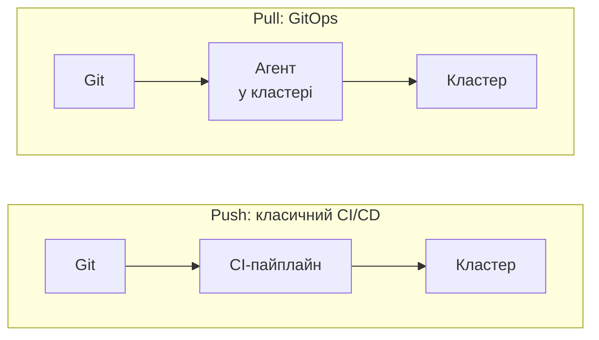
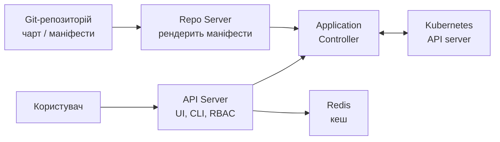
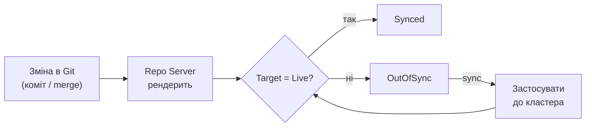
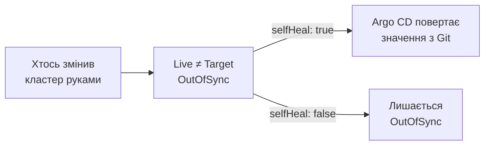
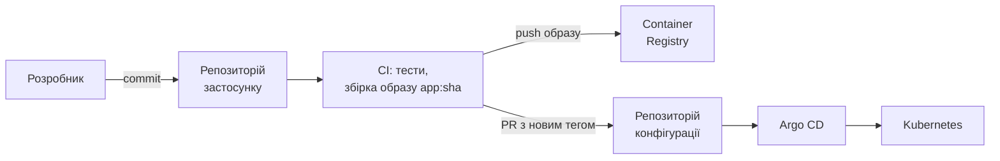
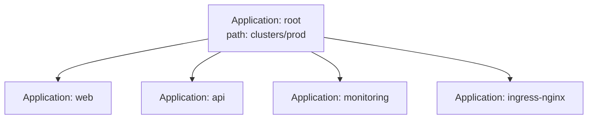

# GitOps та Argo CD: розгортання через Git

<small>Технології DevOps</small>

<style>
.reveal h1 { font-size: 1.7em; }
.reveal h2 { font-size: 1.2em; }
.reveal h3 { font-size: 0.95em; }
.reveal p, .reveal li { font-size: 0.62em; line-height: 1.4; }
.reveal blockquote { font-size: 0.7em; }
.reveal table { font-size: 0.58em; }
.reveal small { font-size: 0.5em; }
.reveal pre, .reveal code { font-size: 0.48em; }
.reveal ol, .reveal ul { display: inline-block; text-align: left; }

.reveal .mermaid,
.reveal .mermaid svg {
  width: 100% !important;
  height: auto !important;
  max-width: 1000px;
  max-height: 560px;
}
.reveal .mermaid { display: flex; justify-content: center; }
.reveal .mermaid .nodeLabel,
.reveal .mermaid text,
.reveal .mermaid tspan,
.reveal .mermaid .edgeLabel {
  fill: #1e293b !important;
  color: #1e293b !important;
}
.reveal .mermaid .node rect,
.reveal .mermaid .node polygon,
.reveal .mermaid .node circle {
  fill: #f4f1ea !important;
  stroke: #1e293b !important;
}
.reveal .mermaid .cluster rect {
  fill: #eef2ff !important;
  stroke: #94a3b8 !important;
}

.card-row { display: flex; gap: 1.2rem; justify-content: center; margin-top: 1rem; flex-wrap: wrap; }
.card { background: #f4f1ea; border-radius: 12px; padding: 0.8rem 1.2rem; font-size: 0.6em; text-align: left; flex: 1; min-width: 220px; max-width: 320px; }
.card b { font-size: 1.1em; }
.card.warn { background: #fef3c7; }
.card.ok { background: #dcfce7; }

.tree { background: #f4f1ea; border-radius: 12px; padding: 1rem 1.5rem; font-size: 0.5em; text-align: left; display: inline-block; font-family: monospace; line-height: 1.6; }

.callout { background: #fef3c7; border-left: 6px solid #d97706; border-radius: 8px; padding: 0.6rem 1rem; font-size: 0.6em; text-align: left; margin-top: 1rem; }
</style>

Note: Ця лекція продовжує Helm. Минулого разу ми навчилися пакувати застосунок у чарт і розгортати його командою helm upgrade --install. Тепер питання: хто і звідки цю команду запускає, і як гарантувати, що кластер дійсно відповідає тому, що ми задумали. Мета — щоб студенти сприймали GitOps не як модний інструмент, а як підхід: Git стає єдиним джерелом правди, а кластер сам підтягує зміни. Argo CD — лише одна з реалізацій цієї ідеї.

---

## Де ми зупинилися

- Застосунок упакований у Helm-чарт, значення для середовищ лежать у `values-*.yaml`
- Розгортаємо з пайплайна: `helm upgrade --install web ./mychart -f prod.yaml --atomic`
- Працює, поки пайплайн один, а кластер один
<!-- .element: class="fragment" -->

--

### Що не так із підходом «CI штовхає в кластер»

<div class="card-row">
<div class="card warn"><b>Ключі від кластера в CI</b><br>kubeconfig з правами на запис лежить у змінних пайплайна: це ціль для атаки</div>
<div class="card warn"><b>Дрейф конфігурації</b><br>хтось зробив <code>kubectl edit</code> на проді, і Git уже не відповідає реальності</div>
<div class="card warn"><b>«Що зараз у кластері?»</b><br>відповідь у логах останнього успішного джоба, а не в одному місці</div>
<div class="card warn"><b>Кілька кластерів</b><br>пайплайн мусить знати про кожен і мати доступ до кожного</div>
</div>

Note: Корисно запитати аудиторію: хто має доступ до змінних CI у вашій команді? Зазвичай відповідь «усі розробники з правом на репозиторій». А тепер уявіть, що там лежить kubeconfig прод-кластера. Окремо про дрейф: класична історія, коли хтось уночі підкрутив кількість реплік руками, щоб загасити інцидент, і забув повернути. Наступний деплой або перетирає цю правку, або (гірше) ніхто не знає, що вона була.

---

## План заняття

1. Ідея GitOps і його принципи
2. Argo CD: архітектура та об'єкт Application
3. Синхронізація, самолікування, відкат
4. Структура репозиторіїв, масштабування, практика

---

<!-- .slide: data-background-color="#eef2ff" -->

# Частина 1

## Ідея GitOps

---

## Що таке GitOps

> Бажаний стан системи описаний декларативно й лежить у Git. Спеціальний агент постійно порівнює його з реальним станом і приводить систему до описаного.

- Термін з'явився у 2017 році, його популяризувала компанія Weaveworks
- Зараз є спільний стандарт — **OpenGitOps** (проєкт під егідою CNCF)
<!-- .element: class="fragment" -->

Note: Важливо підкреслити, що GitOps не прив'язаний до Kubernetes принципово, але на практиці майже завжди використовується саме з ним: Kubernetes уже декларативний, і його контролери самі по собі працюють за схемою «порівняти бажане з фактичним». GitOps просто піднімає цю ідею на рівень усієї системи.

---

## Чотири принципи OpenGitOps

<div class="card-row">
<div class="card"><b>1. Декларативність</b><br>система описана як бажаний стан, а не як послідовність команд</div>
<div class="card"><b>2. Версіонованість</b><br>стан зберігається так, що історія незмінна й відтворювана: Git</div>
<div class="card"><b>3. Автоматичне отримання</b><br>агент сам забирає опис із джерела, ніхто не штовхає його ззовні</div>
<div class="card"><b>4. Безперервне узгодження</b><br>агент постійно виправляє розбіжності, а не лише в момент деплою</div>
</div>

---

## Push і Pull



- У Push доступ до кластера має **пайплайн ззовні**
- У Pull агент **усередині** кластера сам ходить до Git: вхідний доступ до кластера не потрібен
<!-- .element: class="fragment" -->

---

## Що це дає

<div class="card-row">
<div class="card ok"><b>Аудит «безкоштовно»</b><br>хто, що й коли змінив у продакшні: це історія комітів</div>
<div class="card ok"><b>Відкат = git revert</b><br>повертаємо коміт, агент повертає кластер</div>
<div class="card ok"><b>Безпека</b><br>креденшели кластера не виходять за його межі</div>
</div>
<div class="card-row">
<div class="card ok"><b>Ревʼю змін</b><br>зміна інфраструктури проходить pull request, як і код</div>
<div class="card ok"><b>Відновлення</b><br>новий кластер піднімається з того самого репозиторію</div>
<div class="card ok"><b>Виявлення дрейфу</b><br>різницю між Git і кластером видно одразу</div>
</div>

---

<!-- .slide: data-background-color="#eef2ff" -->

# Частина 2

## Argo CD

---

## Що таке Argo CD

- Декларативний GitOps-контролер для Kubernetes
- Походить із проєкту Argo (Intuit), входить до CNCF і має статус **graduated**
- Працює як набір компонентів **усередині кластера**
- Має веб-інтерфейс, CLI та власні CRD
<!-- .element: class="fragment" -->

Note: Argo — це родина проєктів: Argo CD (доставка), Argo Workflows (пайплайни в кластері), Argo Rollouts (прогресивні розгортання), Argo Events (події). Не плутати: на цій лекції йдеться лише про Argo CD. Головна його перевага для навчання — наочний інтерфейс: студенти бачать дерево об'єктів застосунку і колір статусу кожного, і це відразу прояснює, що відбувається.

---

## Архітектура



- **Repo Server** клонує репозиторій і генерує маніфести (Helm, Kustomize, звичайний YAML)
- **Application Controller** порівнює бажаний стан із живим і запускає синхронізацію
<!-- .element: class="fragment" -->

---

## Встановлення

```bash
kubectl create namespace argocd
kubectl apply -n argocd --server-side --force-conflicts \
  -f https://raw.githubusercontent.com/argoproj/argo-cd/stable/manifests/install.yaml

# доступ до інтерфейсу
kubectl port-forward svc/argocd-server -n argocd 8080:443

# початковий пароль користувача admin
argocd admin initial-password -n argocd
```

- Є також офіційний Helm-чарт для встановлення (тоді сам Argo CD теж керується як код)
- Початковий пароль слід **змінити**, а секрет із ним видалити
<!-- .element: class="fragment" -->

---

## Application: головний об'єкт

```yaml
apiVersion: argoproj.io/v1alpha1
kind: Application
metadata:
  name: web
  namespace: argocd
spec:
  project: default
  source:
    repoURL: https://github.com/example/config-repo.git
    targetRevision: main
    path: apps/web/prod
  destination:
    server: https://kubernetes.default.svc
    namespace: web
```

Application відповідає на два питання: **звідки** брати опис і **куди** його застосовувати

Note: Зверніть увагу, що Application — це звичайний ресурс Kubernetes (CRD), тобто сам його теж можна покласти в Git і застосувати. Адреса https://kubernetes.default.svc означає «той самий кластер, де працює Argo CD». Для керування зовнішніми кластерами їх реєструють командою argocd cluster add, і тоді один Argo CD може розгортати в десятки кластерів.

---

## Термінологія

| Термін | Що це |
|---|---|
| **Application** | зв'язка «джерело в Git → ціль у кластері» |
| **Target state** | бажаний стан, те, що описано в Git |
| **Live state** | фактичний стан об'єктів у кластері |
| **Sync status** | `Synced` або `OutOfSync`: чи збігаються target і live |
| **Health status** | `Healthy`, `Progressing`, `Degraded`, `Missing`, `Suspended` |
| **Project** | межі дозволеного: які репозиторії та кластери можна використовувати |

Sync і Health — **різні** речі: застосунок може бути `Synced`, але `Degraded`
<!-- .element: class="fragment" -->

---

## Джерела: що вміє рендерити Argo CD

<div class="card-row">
<div class="card"><b>Звичайні маніфести</b><br>каталог із YAML</div>
<div class="card"><b>Helm</b><br>чарт із репозиторію Git або Helm-репозиторію + values</div>
<div class="card"><b>Kustomize</b><br>база й накладки</div>
</div>

```yaml
source:
  repoURL: https://github.com/example/config-repo.git
  path: charts/web
  helm:
    valueFiles:
      - values-prod.yaml
```

<div class="callout">Argo CD використовує Helm лише як <b>шаблонізатор</b> (аналог <code>helm template</code>). Команда <code>helm list</code> не покаже таких релізів, а історією та відкатом керує Git, а не секрети <code>helm.sh/release.v1</code>.</div>
<!-- .element: class="fragment" -->

Note: Це місток до попередньої лекції. Студенти щойно вчили, що Helm зберігає ревізії в Secret-ах кластера. З Argo CD цього не відбувається: рендеринг відбувається в repo-server, а до кластера їдуть уже готові маніфести. Тому helm rollback тут не застосовується, відкочуємо комітом. Helm-хуки Argo CD вміє перетворювати на власні хуки, але це окрема тема.

---

<!-- .slide: data-background-color="#eef2ff" -->

# Частина 3

## Синхронізація

---

## Цикл узгодження



- За замовчуванням Argo CD опитує Git приблизно кожні **3 хвилини**
- Щоб реагувати миттєво, налаштовують **webhook** від Git-сервера
<!-- .element: class="fragment" -->

---

## Політика синхронізації

```yaml
spec:
  syncPolicy:
    automated:
      prune: true
      selfHeal: true
    syncOptions:
      - CreateNamespace=true
```

<div class="card-row">
<div class="card"><b>Без automated</b><br>Argo CD лише показує <code>OutOfSync</code>, а синхронізацію запускає людина</div>
<div class="card"><b>prune</b><br>видаляє з кластера об'єкти, яких більше немає в Git</div>
<div class="card"><b>selfHeal</b><br>повертає стан, якщо хтось змінив кластер руками</div>
</div>

Note: Типова практика: на dev вмикають повністю автоматичну синхронізацію, на prod лишають ручну або автоматичну, але зі строгим ревʼю в Git. prune за замовчуванням вимкнений саме тому, що видалення — потенційно небезпечна дія. Продемонструйте selfHeal на практиці: зменшити репліки через kubectl і подивитися, як Argo CD повертає їх назад за кілька секунд.

---

## Самолікування в дії

```bash
kubectl scale deployment web -n web --replicas=5
```



Тепер `kubectl edit` на проді не просто небажаний: він **не діє**. Єдиний шлях зміни: комміт у Git
<!-- .element: class="fragment" -->

---

## Порядок розгортання: waves і hooks

```yaml
metadata:
  annotations:
    argocd.argoproj.io/sync-wave: "1"
```

- Об'єкти застосовуються хвилями за зростанням номера; наступна хвиля чекає, поки попередня стане `Healthy`
- Типовий приклад: namespace і CRD (хвиля 0), потім база даних (1), потім застосунок (2)

```yaml
metadata:
  annotations:
    argocd.argoproj.io/hook: PreSync
    argocd.argoproj.io/hook-delete-policy: HookSucceeded
```

- Хуки `PreSync`, `Sync`, `PostSync`, `SyncFail`: наприклад, **міграція БД** перед оновленням
<!-- .element: class="fragment" -->

---

## Відкат

<div class="card-row">
<div class="card ok"><b>Правильний шлях</b><br><code>git revert</code> → pull request → merge. Git лишається єдиним джерелом правди</div>
<div class="card warn"><b>Швидкий шлях</b><br><code>argocd app rollback web &lt;ID&gt;</code> повертає попередню ревізію, але лише якщо вимкнена автосинхронізація</div>
</div>

<div class="callout">Якщо <code>automated</code> увімкнено, кластер за секунди повернеться до того, що в Git, тож ручний відкат просто втратить сенс. Відкочувати треба <b>в Git</b>.</div>
<!-- .element: class="fragment" -->

Note: Це приємний контраст із Helm, де rollback — штатна команда. У GitOps мислення інше: ми не «повертаємо кластер», а «повертаємо опис», і кластер за ним слідує. Додатковий бонус: у Git лишається слід, що відкат був, хто його зробив і чому (повідомлення коміту).

---

## Ігнорування очікуваних відмінностей

```yaml
spec:
  ignoreDifferences:
    - group: apps
      kind: Deployment
      jsonPointers:
        - /spec/replicas
```

- Деякі поля змінює не людина, а інший контролер: наприклад, **HPA** змінює `replicas`
- Без `ignoreDifferences` застосунок вічно буде `OutOfSync`, а `selfHeal` боротиметься з автомасштабуванням
<!-- .element: class="fragment" -->

---

<!-- .slide: data-background-color="#eef2ff" -->

# Частина 4

## Репозиторії, масштабування, практика

---

## Два репозиторії: код і конфігурація



- **CI** відповідає за збірку й тести, **Argo CD**: за доставку
- Пайплайн більше не має доступу до кластера: він лише змінює тег в репозиторії конфігурації
<!-- .element: class="fragment" -->

Note: Чому окремий репозиторій конфігурації? По-перше, коміт «збільшили реплік» не повинен запускати збірку застосунку. По-друге, різні права доступу: розробники пишуть код, а прод-конфігурацію правлять лише обрані люди. По-третє, уникаємо циклу, коли CI комітить у той самий репозиторій, який його запускає. Для дрібних проєктів один репозиторій цілком прийнятний, це компроміс між простотою й гігієною.

---

## Структура репозиторію конфігурації

<div class="tree">
config-repo/<br>
├── apps/<br>
│&nbsp;&nbsp;&nbsp;└── web/<br>
│&nbsp;&nbsp;&nbsp;&nbsp;&nbsp;&nbsp;&nbsp;├── base/&nbsp;&nbsp;&nbsp;&nbsp;&nbsp;&nbsp;&nbsp;&nbsp;&nbsp;# спільне для всіх середовищ<br>
│&nbsp;&nbsp;&nbsp;&nbsp;&nbsp;&nbsp;&nbsp;└── overlays/<br>
│&nbsp;&nbsp;&nbsp;&nbsp;&nbsp;&nbsp;&nbsp;&nbsp;&nbsp;&nbsp;&nbsp;├── dev/<br>
│&nbsp;&nbsp;&nbsp;&nbsp;&nbsp;&nbsp;&nbsp;&nbsp;&nbsp;&nbsp;&nbsp;├── staging/<br>
│&nbsp;&nbsp;&nbsp;&nbsp;&nbsp;&nbsp;&nbsp;&nbsp;&nbsp;&nbsp;&nbsp;└── prod/<br>
└── clusters/<br>
&nbsp;&nbsp;&nbsp;&nbsp;├── dev/&nbsp;&nbsp;&nbsp;&nbsp;&nbsp;&nbsp;&nbsp;&nbsp;&nbsp;&nbsp;&nbsp;&nbsp;# Application-и для dev-кластера<br>
&nbsp;&nbsp;&nbsp;&nbsp;└── prod/&nbsp;&nbsp;&nbsp;&nbsp;&nbsp;&nbsp;&nbsp;&nbsp;&nbsp;&nbsp;&nbsp;# Application-и для prod-кластера
</div>

Середовища: **каталоги**, а не гілки. Так видно різницю між ними поруч і немає нескінченних merge між `dev` і `prod`
<!-- .element: class="fragment" -->

---

## Просування між середовищами

- Зміна тега образу спершу потрапляє в `dev`
- Просування на `staging` і `prod`: окремий коміт або pull request, який хтось ревʼюїть
- Автоматизувати оновлення тегів можна інструментами на кшталт **Argo CD Image Updater** або скриптом у CI
<!-- .element: class="fragment" -->

<div class="callout">Просування — це <b>зміна файлу в Git</b>, а не окрема кнопка в системі деплою. Тому в нього є автор, ревʼю та історія.</div>
<!-- .element: class="fragment" -->

---

## AppProject: межі дозволеного

```yaml
apiVersion: argoproj.io/v1alpha1
kind: AppProject
metadata:
  name: team-web
  namespace: argocd
spec:
  sourceRepos:
    - https://github.com/example/config-repo.git
  destinations:
    - server: https://kubernetes.default.svc
      namespace: web-*
  clusterResourceWhitelist: []
```

- Команда може розгортати **лише зі своїх репозиторіїв** і **лише у свої namespace**
- RBAC самого Argo CD вирішує, хто може синхронізувати чи видаляти застосунки
<!-- .element: class="fragment" -->

---

## Багато застосунків: ApplicationSet

```yaml
apiVersion: argoproj.io/v1alpha1
kind: ApplicationSet
metadata:
  name: web-envs
  namespace: argocd
spec:
  generators:
    - list:
        elements:
          - env: dev
          - env: staging
          - env: prod
  template:
    metadata:
      name: 'web-{{env}}'
    spec:
      project: team-web
      source:
        repoURL: https://github.com/example/config-repo.git
        targetRevision: main
        path: 'apps/web/overlays/{{env}}'
      destination:
        server: https://kubernetes.default.svc
        namespace: 'web-{{env}}'
```

Note: ApplicationSet — це «Helm для самих Application-ів»: один шаблон і генератор, який створює потрібну кількість об'єктів. Окрім list є генератори git (по каталогах або файлах репозиторію) і cluster (по всіх зареєстрованих кластерах). Останній особливо корисний: зареєстрували новий кластер, і в ньому автоматично зʼявилися всі базові застосунки.

---

## App of Apps



- Кореневий Application вказує на каталог, де лежать **інші Application**
- Один `kubectl apply` піднімає всю платформу кластера: це і є *bootstrap*
- Сам Argo CD теж можна описати в Git та вести цим же підходом
<!-- .element: class="fragment" -->

---

## Секрети в GitOps

<div class="callout">Секрети відкритим текстом у Git <b>класти не можна</b>. Base64 у Secret: це не шифрування.</div>

| Підхід | Як працює |
|---|---|
| **Sealed Secrets** | у Git лежить зашифрований секрет, розшифрувати його може лише контролер у кластері |
| **SOPS** | шифруються значення у файлі, ключ у KMS або age |
| **External Secrets Operator** | у Git лише посилання на секрет, а значення тягнеться з Vault, хмарного сховища |

Note: Це найнеприємніше запитання GitOps, і студенти його ставлять майже завжди: «а як щодо паролів?». Чесна відповідь: сама ідея «усе в Git» змушує окремо вирішувати секрети. Найпоширеніший сучасний вибір — External Secrets, бо значення взагалі не потрапляють у репозиторій, навіть у зашифрованому вигляді. Це продовжує тему з попередньої лекції про Helm, де секрети у values.yaml були в списку типових помилок.

---

## Практика: перший застосунок

```bash
minikube start
kubectl create namespace argocd
kubectl apply -n argocd --server-side --force-conflicts \
  -f https://raw.githubusercontent.com/argoproj/argo-cd/stable/manifests/install.yaml

kubectl port-forward svc/argocd-server -n argocd 8080:443 &
argocd admin initial-password -n argocd
argocd login localhost:8080 --username admin --insecure
```

--

### Створення та синхронізація

```bash
argocd app create guestbook \
  --repo https://github.com/argoproj/argocd-example-apps.git \
  --path guestbook \
  --dest-server https://kubernetes.default.svc \
  --dest-namespace default

argocd app get guestbook        # статус OutOfSync
argocd app sync guestbook       # застосувати
kubectl get pods
```

--

### Експеримент із дрейфом

```bash
argocd app set guestbook --sync-policy automated --self-heal

kubectl scale deployment guestbook-ui --replicas=3
kubectl get pods -w             # Argo CD повертає кількість реплік

argocd app history guestbook
```

Варто звернути увагу: інтерфейс показує дерево об'єктів, а колір кожного з них відповідає статусу

Note: Хороша вправа на пару: форкнути репозиторій argocd-example-apps, змінити в ньому кількість реплік комітом і подивитися, як Argo CD доставить зміну без жодної команди з боку студента. Друга вправа: навмисно вказати в маніфесті неіснуючий образ і побачити Degraded у Health при Synced у Sync: так студенти зрозуміють різницю між двома статусами.

---

## Argo CD і Flux

| | Argo CD | Flux |
|---|---|---|
| **Інтерфейс** | веб-UI, CLI | переважно CLI й CRD (UI через додаткові проєкти) |
| **Модель** | централізований сервер, керує багатьма кластерами | набір контролерів, зазвичай окремо в кожному кластері |
| **Об'єкти** | `Application`, `AppProject` | `GitRepository`, `Kustomization`, `HelmRelease` |
| **Статус у CNCF** | graduated | graduated |

Обидва реалізують принципи OpenGitOps. Вибір найчастіше визначають звичка команди та потреба в UI
<!-- .element: class="fragment" -->

Note: Суперечка Argo CD проти Flux — така сама вічна, як Helm проти Kustomize. Прихильники Argo наголошують на наочності й зручній мультикластерності, прихильники Flux: на мінімалізмі та «нативності» до Kubernetes. Для навчання Argo CD зручніший завдяки інтерфейсу, але важливо донести, що знання принципів переноситься на будь-який інструмент.

---

## Типові помилки

<div class="card-row">
<div class="card warn"><b>Секрети в Git відкритим текстом</b><br>потрібні Sealed Secrets, SOPS або External Secrets</div>
<div class="card warn"><b>Правки через kubectl</b><br>при <code>selfHeal</code> вони зникнуть, без нього спричинять дрейф</div>
<div class="card warn"><b>CI комітить у той самий репозиторій</b><br>можна отримати нескінченний цикл збірок</div>
<div class="card warn"><b>Вічний OutOfSync</b><br>інший контролер (HPA тощо) міняє поле: потрібен <code>ignoreDifferences</code></div>
</div>
<div class="card-row">
<div class="card warn"><b>prune без обережності</b><br>видалення з Git означає видалення з кластера</div>
<div class="card warn"><b>Плаваюча ревізія</b><br><code>targetRevision: HEAD</code> на проді; краще тег або захищена гілка</div>
</div>

---

## Підсумки

- GitOps: **Git — єдине джерело правди**, а агент у кластері постійно приводить стан до описаного
- Pull-модель прибирає ключі від кластера з CI й дає виявлення дрейфу
- Argo CD описує зв'язку «Git → кластер» об'єктом `Application`, а Sync і Health це різні статуси
- Відкат, ревʼю й аудит: це звичайні операції з Git
- Масштабування: `AppProject`, `ApplicationSet`, App of Apps
- Секрети треба вирішувати окремо

--

### Що далі

<div class="card-row">
<div class="card"><b>Progressive delivery</b><br>Argo Rollouts: canary та blue-green</div>
<div class="card"><b>Observability</b><br>Prometheus і Grafana: стан кластера й самого Argo CD</div>
<div class="card"><b>Безпека</b><br>політики (Kyverno, OPA Gatekeeper), керування секретами</div>
</div>

---

## Питання для закріплення

1. Чим pull-модель GitOps відрізняється від push-деплою з CI і які в неї переваги для безпеки?
2. Чим `Sync status` відрізняється від `Health status`? Наведіть приклад `Synced`, але `Degraded`
3. Що робить `selfHeal` і чому ручний `kubectl edit` на такому застосунку марний?
4. Чому в GitOps відкочують через `git revert`, а не командою rollback?
5. Навіщо окремий репозиторій конфігурації й як CI оновлює версію застосунку?

---

# Дякую за увагу

<small>argo-cd.readthedocs.io · opengitops.dev</small>
