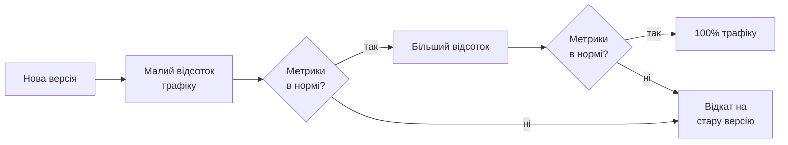
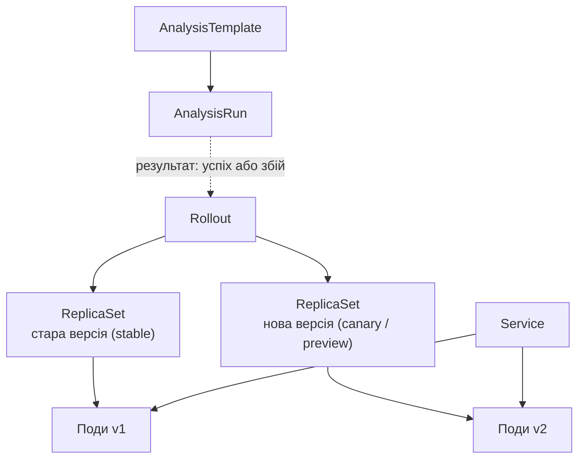
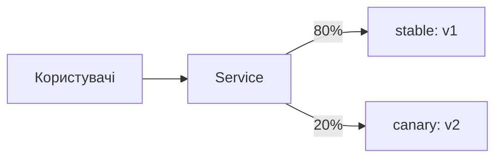
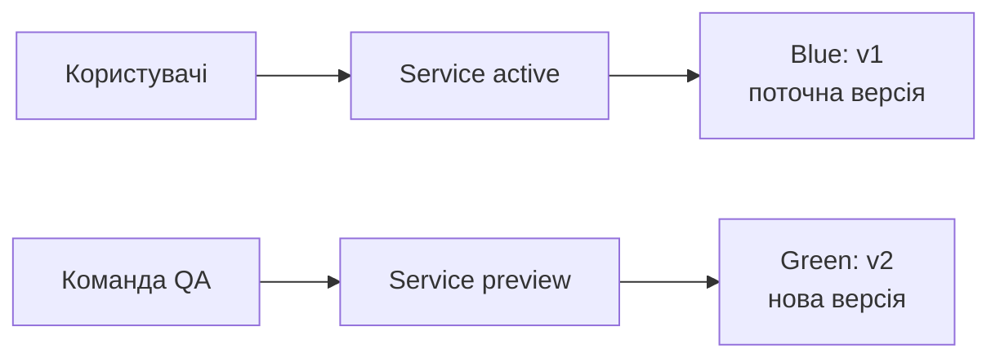
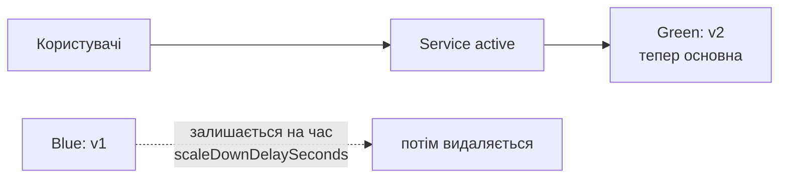
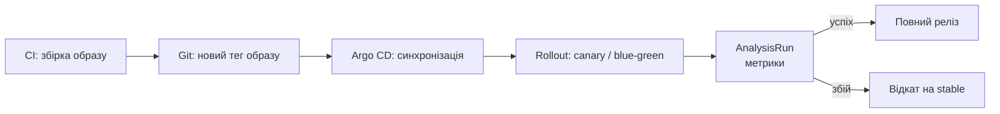

# Progressive delivery: Argo Rollouts

<small>Технології DevOps</small>

<style>
.reveal h1 { font-size: 1.7em; }
.reveal h2 { font-size: 1.2em; }
.reveal h3 { font-size: 0.95em; }
.reveal p, .reveal li { font-size: 0.62em; line-height: 1.4; }
.reveal blockquote { font-size: 0.7em; }
.reveal table { font-size: 0.58em; }
.reveal small { font-size: 0.5em; }
.reveal pre, .reveal code { font-size: 0.48em; }
.reveal ol, .reveal ul { display: inline-block; text-align: left; }

.reveal .mermaid,
.reveal .mermaid svg {
  width: 100% !important;
  height: auto !important;
  max-width: 1000px;
  max-height: 560px;
}
.reveal .mermaid { display: flex; justify-content: center; }
.reveal .mermaid .nodeLabel,
.reveal .mermaid text,
.reveal .mermaid tspan,
.reveal .mermaid .edgeLabel {
  fill: #1e293b !important;
  color: #1e293b !important;
}
.reveal .mermaid .node rect,
.reveal .mermaid .node polygon,
.reveal .mermaid .node circle {
  fill: #f4f1ea !important;
  stroke: #1e293b !important;
}
.reveal .mermaid .cluster rect {
  fill: #eef2ff !important;
  stroke: #94a3b8 !important;
}

.card-row { display: flex; gap: 1.2rem; justify-content: center; margin-top: 1rem; flex-wrap: wrap; }
.card { background: #f4f1ea; border-radius: 12px; padding: 0.8rem 1.2rem; font-size: 0.6em; text-align: left; flex: 1; min-width: 220px; max-width: 320px; }
.card b { font-size: 1.1em; }
.card.warn { background: #fef3c7; }
.card.ok { background: #dcfce7; }

.tree { background: #f4f1ea; border-radius: 12px; padding: 1rem 1.5rem; font-size: 0.5em; text-align: left; display: inline-block; font-family: monospace; line-height: 1.6; }

.callout { background: #fef3c7; border-left: 6px solid #d97706; border-radius: 8px; padding: 0.6rem 1rem; font-size: 0.6em; text-align: left; margin-top: 1rem; }
</style>

Note: Ця лекція продовжує GitOps. Минулого разу ми розібралися, як Argo CD доставляє зміни з Git у кластер. Тепер питання: що саме відбувається в кластері в момент, коли нова версія застосунку приїхала? Argo CD вміє синхронізувати, але сама по собі синхронізація не відповідає на питання «а чи не зламає нова версія прод». Мета лекції: показати, що розгортання можна робити поступово й автоматично зупиняти за метриками, а Argo Rollouts — один зі способів це зробити в Kubernetes.

---

## Де ми зупинилися

- Застосунок упакований в Helm-чарт, а Argo CD тримає кластер у відповідності до Git
- Новий реліз — це коміт зі зміненим тегом образу
- Argo CD бачить зміну, синхронізує, `Deployment` оновлюється
<!-- .element: class="fragment" -->
- Але що буде, якщо нова версія компілюється, проходить тести, стартує, і при цьому віддає помилки під реальним навантаженням?
<!-- .element: class="fragment" -->

--

### Що вміє стандартний `Deployment`

<div class="card-row">
<div class="card ok"><b>RollingUpdate</b><br>поступово замінює поди старої версії на нові</div>
<div class="card ok"><b>Readiness probe</b><br>не пускає трафік на под, який ще не готовий</div>
<div class="card ok"><b>Відкат</b><br><code>kubectl rollout undo</code> повертає попередній ReplicaSet</div>
</div>

<div class="card-row">
<div class="card warn"><b>Немає контролю швидкості</b><br>частку нових подів визначає лише <code>maxSurge</code> і <code>maxUnavailable</code></div>
<div class="card warn"><b>Немає пауз</b><br>не можна зупинитися на 10% і подивитися на метрики</div>
<div class="card warn"><b>Немає аналізу</b><br>помилки 5xx для Kubernetes не є причиною зупинити оновлення</div>
<div class="card warn"><b>Немає керування трафіком</b><br>частка трафіку дорівнює частці подів</div>
</div>

Note: Хороше запитання до аудиторії: що вважає Kubernetes «успішним» оновленням? Відповідь: поди пройшли readiness probe. Це дуже низький поріг. Застосунок може бути готовий приймати запити й водночас віддавати помилки на половині з них, або працювати вдвічі повільніше. Deployment цього не побачить і спокійно докотить оновлення до 100%.

---

## План заняття

1. Progressive delivery: ідея та стратегії розгортання
2. Argo Rollouts: архітектура та об'єкт Rollout
3. Canary
4. Blue-green
5. Автоматичний аналіз метрик
6. Argo CD разом з Argo Rollouts, практика

---

<!-- .slide: data-background-color="#eef2ff" -->

# Частина 1

## Progressive delivery

---

## Що таке Progressive delivery

> Підхід до випуску нових версій, коли зміна доходить до користувачів поступово, під контролем метрик, і в разі проблем швидко відкочується.

- Це розвиток ідей continuous delivery: не просто «розгортати часто», а «розгортати безпечно»
- Термін популяризував аналітик RedMonk Джеймс Говернор близько 2018 року
<!-- .element: class="fragment" -->

--

### Що тут ключове

<div class="card-row">
<div class="card"><b>Малий радіус ураження</b><br>спершу нова версія бачить малу частку користувачів, а не всіх одразу</div>
<div class="card"><b>Рішення за даними</b><br>рухатися далі чи зупинитися, визначають метрики, а не інтуїція</div>
<div class="card"><b>Автоматичний відкат</b><br>якщо метрики погіршилися, система повертає стару версію сама</div>
</div>

Note: Корисний образ: канарка в шахті. Раніше шахтарі брали канарку вниз, і якщо вона втрачала свідомість, було зрозуміло, що в повітрі щось не так, і ніхто більше не страждав. Canary-реліз працює так само: невелика група користувачів «приймає удар» першою. Radius of impact (blast radius) — поняття, до якого ми ще повернемося.

---

## Стратегії розгортання

| | Recreate | Rolling update | Blue-green | Canary |
|---|---|---|---|---|
| **Простій** | є | немає | немає | немає |
| **Додаткові ресурси** | ні | трохи | ×2 на час релізу | трохи |
| **Швидкість відкату** | повільно | повільно | миттєво | швидко |
| **Контроль частки трафіку** | немає | немає | усе або нічого | поступовий |
| **Перевірка реальним трафіком** | ні | без контролю | лише preview | так |

Argo Rollouts реалізує дві крайні праві стратегії: **blue-green** і **canary**
<!-- .element: class="fragment" -->

Note: Recreate: зупинити все старе, запустити нове. Простій гарантований, зате просто й не потрібно, щоб дві версії жили одночасно. Іноді це виправдано, наприклад для міграцій, які несумісні зі старою версією. Rolling update — те, що ми маємо за замовчуванням. Blue-green і canary — предмет сьогоднішньої лекції.

---

## Поступовий реліз у картинці



Note: Ця схема — суть усього заняття. Далі ми будемо говорити про те, як описати її в Kubernetes: кроки, паузи, перевірки, відкат.

---

<!-- .slide: data-background-color="#eef2ff" -->

# Частина 2

## Argo Rollouts

---

## Що таке Argo Rollouts

- Контролер для Kubernetes і набір CRD, що додають поступові стратегії розгортання
- Частина проєкту Argo (разом з Argo CD, Argo Workflows, Argo Events), проєкт CNCF
- Головний об'єкт — `Rollout`, який **замінює** `Deployment`
- Працює з ingress-контролерами й service mesh для точного керування трафіком
<!-- .element: class="fragment" -->

--

### З чого складається

<div class="card-row">
<div class="card"><b>Rollout</b><br>описує застосунок і стратегію оновлення</div>
<div class="card"><b>AnalysisTemplate</b><br>шаблон перевірки: які метрики й за яких умов вважати успішними</div>
<div class="card"><b>AnalysisRun</b><br>конкретний запуск такої перевірки під час релізу</div>
<div class="card"><b>Experiment</b><br>тимчасовий запуск версій поруч для порівняння</div>
</div>

<div class="callout">Для керування з командного рядка потрібен ще плагін <code>kubectl argo rollouts</code>. Він не обов'язковий для роботи контролера, але без нього незручно.</div>

---

## Як це влаштовано



Note: Rollout не створює Pod напряму: як і Deployment, він керує ReplicaSet. Різниця в тому, що Deployment має логіку «замінити один ReplicaSet на інший за схемою rolling update», а Rollout — набір кроків, які контролер виконує по черзі. Між кроками він може ставити паузу й запускати AnalysisRun.

---

## Rollout замість Deployment

```yaml
apiVersion: argoproj.io/v1alpha1
kind: Rollout
metadata:
  name: web
spec:
  replicas: 5
  revisionHistoryLimit: 3
  selector:
    matchLabels:
      app: web
  template:                 # той самий шаблон пода, що й у Deployment
    metadata:
      labels:
        app: web
    spec:
      containers:
        - name: web
          image: argoproj/rollouts-demo:blue
          ports:
            - containerPort: 8080
  strategy:
    canary: {}              # або blueGreen: ...
```

Змінилися `apiVersion`, `kind` і блок `strategy`. Решта — як у `Deployment`
<!-- .element: class="fragment" -->

--

### А якщо Deployment вже є

- Поле `workloadRef` дозволяє посилатися на наявний `Deployment`, не переписуючи його
- `Deployment` залишається джерелом шаблону пода, а `Rollout` керує оновленням
- Зручно для поступового переходу, коли не хочеться міняти всі маніфести одразу
<!-- .element: class="fragment" -->

Note: У `workloadRef` є нюанс: сам Deployment після цього масштабують до нуля, щоб він не конкурував з Rollout. Деталі краще показати за документацією, на лекції достатньо знати, що така можливість існує.

---

## Встановлення

```bash
kubectl create namespace argo-rollouts
kubectl apply -n argo-rollouts \
  -f https://github.com/argoproj/argo-rollouts/releases/latest/download/install.yaml
```

Плагін для `kubectl` (на macOS):

```bash
brew install argoproj/tap/kubectl-argo-rollouts
kubectl argo rollouts version
```

<small>Для Linux і Windows плагін завантажують як окремий бінарний файл зі сторінки релізів проєкту</small>

Note: Як і з Argo CD, у реальному кластері краще не застосовувати install.yaml вручну, а описати встановлення контролера як ще один Application в Git або поставити Helm-чартом. Для заняття на minikube достатньо варіанту з kubectl apply.

---

<!-- .slide: data-background-color="#eef2ff" -->

# Частина 3

## Canary

---

## Ідея canary

- Нова версія отримує **малу частку** трафіку, решта йде на стару
- Якщо все добре, частку збільшують крок за кроком
- Якщо щось пішло не так, трафік повертають на стару версію
<!-- .element: class="fragment" -->



--

### Кроки (`steps`)

```yaml
strategy:
  canary:
    steps:
      - setWeight: 20          # 20% на нову версію
      - pause: {}              # чекати ручного підтвердження
      - setWeight: 50
      - pause: {duration: 2m}  # чекати 2 хвилини
      - setWeight: 80
      - pause: {duration: 2m}
      # після останнього кроку нова версія отримує 100%
```

<small>Типи кроків: <code>setWeight</code>, <code>pause</code>, <code>analysis</code>, <code>setCanaryScale</code>, <code>experiment</code></small>

Note: pause без параметрів означає паузу назавжди, поки хтось не виконає promote. Це зручний режим для ручного контролю: людина дивиться на дашборди й вирішує. pause з duration іде далі сам. Потім ми замінимо ручні паузи на автоматичний аналіз.

---

## Як ділиться трафік

<div class="card-row">
<div class="card warn"><b>Без traffic router</b><br>Rollout міняє співвідношення <b>кількості подів</b>. Service розподіляє запити між усіма подами приблизно порівну, тому 20% — це приблизно 1 под із 5. Точність залежить від кількості реплік.</div>
<div class="card ok"><b>З traffic router</b><br>Частка трафіку задається <b>незалежно від кількості подів</b>. Можна мати 100 подів і віддати на canary рівно 1% запитів. Підтримуються Nginx, Istio, AWS ALB, Traefik, SMI, Gateway API тощо.</div>
</div>

Note: Це важлива точка. Без traffic router з 5 репліками мінімальна частка canary — 20%, бо менше ніж одного пода не буває. Для великих сервісів із мільйонами запитів 1% — вже достатня вибірка, а 20% — надто велике ураження. Тому у виробничих сценаріях canary майже завжди використовують разом з ingress-контролером або service mesh.

---

## Canary з керуванням трафіком

```yaml
strategy:
  canary:
    stableService: web-stable    # Service на стару версію
    canaryService: web-canary    # Service на нову версію
    trafficRouting:
      nginx:
        stableIngress: web-ingress
    steps:
      - setWeight: 5
      - pause: {duration: 5m}
      - setWeight: 25
      - pause: {duration: 5m}
      - setWeight: 50
      - pause: {duration: 5m}
```

- Потрібні два `Service` і `Ingress`, який Rollout сам доповнює canary-копією з потрібною вагою
- Для іншого router змінюється тільки блок `trafficRouting`
<!-- .element: class="fragment" -->

---

## Керування релізом

```bash
# спостерігати за розгортанням
kubectl argo rollouts get rollout web --watch

# запустити оновлення (імперативно, для демо)
kubectl argo rollouts set image web web=argoproj/rollouts-demo:yellow

# підтвердити поточну паузу
kubectl argo rollouts promote web

# пропустити всі кроки й одразу розгорнути на 100%
kubectl argo rollouts promote web --full

# скасувати поточний реліз
kubectl argo rollouts abort web
```

<small>Те саме можна побачити у веб-інтерфейсі: <code>kubectl argo rollouts dashboard</code></small>

--

### Що відбувається при `abort`

- Трафік повертається на стару (stable) версію
- Нова версія масштабується донуля
- Rollout переходить у стан `Degraded`: це сигнал, що реліз не завершився успішно
- Спробувати ще раз: `kubectl argo rollouts retry rollout web`
<!-- .element: class="fragment" -->

<div class="callout">Abort і автоматичний відкат на збійному аналізі виглядають однаково. Різниця лише в тому, хто прийняв рішення: людина чи AnalysisRun.</div>

---

<!-- .slide: data-background-color="#eef2ff" -->

# Частина 4

## Blue-green

---

## Ідея blue-green

- Поруч із поточною версією (**blue**) піднімається нова (**green**) в повному обсязі
- Користувачі працюють із blue, а green тестують окремо через preview
- Коли все перевірено, трафік **перемикається одразу**
<!-- .element: class="fragment" -->



--

### Перемикання



Note: Вся магія blue-green в тому, що перемикання — це зміна селектора в Service. Це майже миттєво, і так само миттєво можна повернутися. Стара версія ще деякий час залишається запущеною саме для цього. Ціна — удвічі більше ресурсів на час релізу.

---

## Маніфест blue-green

```yaml
strategy:
  blueGreen:
    activeService: web-active        # трафік користувачів
    previewService: web-preview      # доступ до нової версії для перевірки
    autoPromotionEnabled: false      # перемикати лише вручну
    scaleDownDelaySeconds: 60        # як довго тримати стару версію після перемикання
```

Обидва `Service` створюють окремо, Rollout сам підставляє в них потрібний селектор

<div class="callout">За замовчуванням <code>autoPromotionEnabled: true</code>: щойно нова версія готова, трафік перемикається сам. Для керованого релізу цю опцію вимикають або задають <code>autoPromotionSeconds</code>.</div>

--

### Корисні параметри

<div class="card-row">
<div class="card"><b>previewReplicaCount</b><br>скільки подів нової версії тримати до перемикання, щоб заощадити ресурси</div>
<div class="card"><b>prePromotionAnalysis</b><br>аналіз на preview-версії <b>до</b> перемикання</div>
<div class="card"><b>postPromotionAnalysis</b><br>аналіз <b>після</b> перемикання; при збої виконується відкат</div>
</div>

---

## Canary чи blue-green

| | Canary | Blue-green |
|---|---|---|
| **Частка користувачів, яких зачепила проблема** | мала, поступово зростає | одразу всі після перемикання |
| **Ресурси** | трохи більше за звичайні | подвійні на час релізу |
| **Версії одночасно** | обидві отримують реальний трафік | реальний трафік лише в одної |
| **Швидкість відкату** | швидка | миттєва |
| **Складність** | вища, найкраще з traffic router | нижча |
| **Коли обирати** | великий трафік, потрібні метрики на реальних користувачах | потрібна повна перевірка до перемикання, або дві версії не можуть жити разом |

Note: Універсальної відповіді немає. Якщо новий реліз змінює формат даних так, що дві версії не можуть працювати одночасно, canary не підходить, бо вони якраз працюватимуть одночасно. Якщо ж ресурсів мало, а сервіс великий, подвоювати його заради blue-green дорого. Типова практика: canary для основних сервісів із високим трафіком, blue-green для невеликих і для тих, що потребують повної перевірки на preview.

---

<!-- .slide: data-background-color="#eef2ff" -->

# Частина 5

## Автоматичний аналіз

---

## Навіщо автоматизувати рішення

- Людина, яка натискає `promote`, — слабка ланка: вона відволікається, спить, не дивиться на правильний дашборд
- Метрики вже є: частка помилок, затримки, використання ресурсів
- Argo Rollouts вміє брати ці метрики й **сам вирішувати**, продовжувати реліз чи відкочувати
<!-- .element: class="fragment" -->

--

### AnalysisTemplate

```yaml
apiVersion: argoproj.io/v1alpha1
kind: AnalysisTemplate
metadata:
  name: success-rate
spec:
  args:
    - name: service-name
  metrics:
    - name: success-rate
      interval: 1m              # як часто вимірювати
      count: 5                  # скільки вимірів зробити
      failureLimit: 1           # скільки невдач допустимо
      successCondition: result[0] >= 0.95
      provider:
        prometheus:
          address: http://prometheus.monitoring:9090
          query: |
            sum(rate(http_requests_total{service="{{args.service-name}}",status!~"5.."}[2m]))
            /
            sum(rate(http_requests_total{service="{{args.service-name}}"}[2m]))
```

Note: Прочитати цей шаблон слід словами: кожну хвилину п'ять разів питаємо Prometheus про частку запитів без 5xx. Якщо вона нижча за 95% більше ніж один раз, аналіз провалений. Параметр service-name дозволяє використовувати той самий шаблон для різних сервісів. Шаблон не прив'язаний до конкретного Rollout, тому його зручно тримати в Git окремо й перевикористовувати.

---

## Підключення аналізу до canary

```yaml
strategy:
  canary:
    steps:
      - setWeight: 10
      - analysis:                 # крок: дочекатися результату аналізу
          templates:
            - templateName: success-rate
          args:
            - name: service-name
              value: web-canary
      - setWeight: 50
      - pause: {duration: 5m}
```

- Якщо аналіз успішний — реліз іде до наступного кроку
- Якщо аналіз збійний — автоматичний `abort` і повернення на stable
<!-- .element: class="fragment" -->

--

### Фоновий аналіз

```yaml
strategy:
  canary:
    analysis:                     # працює паралельно з кроками
      templates:
        - templateName: success-rate
      startingStep: 1             # з якого кроку почати
      args:
        - name: service-name
          value: web-canary
    steps:
      - setWeight: 10
      - pause: {duration: 5m}
      - setWeight: 50
      - pause: {duration: 5m}
```

Фоновий аналіз перевіряє метрики **протягом усього релізу**, а не в одному кроці. Збій у будь-який момент зупиняє реліз

---

## Звідки брати дані

<div class="card-row">
<div class="card"><b>Prometheus</b><br>найчастіший варіант: частки помилок, затримки, власні метрики застосунку</div>
<div class="card"><b>Хмарні й комерційні системи</b><br>Datadog, New Relic, CloudWatch та інші</div>
<div class="card"><b>Web</b><br>запит на довільний HTTP-ендпоінт і перевірка відповіді</div>
<div class="card"><b>Job</b><br>запуск Kubernetes Job (наприклад, смоук-тестів); код завершення вирішує результат</div>
</div>

<div class="callout">Для початку достатньо двох-трьох показників: частка помилок, затримка (p95 або p99) і насиченість ресурсів. Їх називають «золотими сигналами». Багато метрик — не краще: зростає шанс хибних відкатів.</div>

---

<!-- .slide: data-background-color="#eef2ff" -->

# Частина 6

## Argo CD разом з Argo Rollouts

---

## Як вони працюють разом



- **Argo CD** відповідає за те, щоб у кластері був правильний маніфест із Git
- **Argo Rollouts** відповідає за те, **як** нова версія виїжджає
<!-- .element: class="fragment" -->

--

### Що показує Argo CD під час релізу

<div class="card-row">
<div class="card"><b>Реліз іде</b><br>Sync: <code>Synced</code><br>Health: <code>Progressing</code></div>
<div class="card"><b>Пауза на кроці</b><br>Sync: <code>Synced</code><br>Health: <code>Suspended</code></div>
<div class="card warn"><b>Abort або збійний аналіз</b><br>Sync: <code>Synced</code><br>Health: <code>Degraded</code></div>
</div>

Argo CD розуміє ресурс `Rollout` і показує його стан у своєму інтерфейсі

Note: Це гарна нагода повернутися до минулої лекції: Sync і Health — різні статуси. Після abort маніфест у Git і в кластері однаковий (там усе ще нова версія), тому Synced. Але реліз не пройшов, тому Degraded. Це точно той приклад, який ми питали наприкінці лекції про GitOps.

---

## Підводні камені інтеграції

<div class="card-row">
<div class="card warn"><b>Імперативні команди й selfHeal</b><br><code>set image</code> або ручна зміна <code>Rollout</code> буде перетерта Argo CD, бо Git не змінився. Для реальних релізів змінюємо Git.</div>
<div class="card warn"><b>Abort — не відкат у Git</b><br>Abort зупиняє поточний реліз, але в Git залишається нова версія. Щоб прибрати її остаточно, роблять <code>git revert</code>.</div>
<div class="card warn"><b>Пауза без таймера</b><br><code>pause: {}</code> чекає на людину. Якщо ніхто не підтвердить, реліз висітиме годинами.</div>
</div>

Note: Про abort докладно: це операційний інструмент, а не заміна Git. Якщо зробити abort і не відкотити коміт, наступна синхронізація Argo CD нічого не змінить, бо стан у Git уже збігається з кластером, але Rollout залишиться в Degraded. Для правильного GitOps-відкату потрібно повернути зміну в Git, а далі Rollout сам виконає її за своєю стратегією.

---

## Argo Rollouts і Flagger

| | Argo Rollouts | Flagger |
|---|---|---|
| **Підхід** | власний ресурс `Rollout` замість `Deployment` | працює поверх наявного `Deployment`, створює власні копії |
| **Екосистема** | пов'язаний з Argo CD | пов'язаний з Flux |
| **Стратегії** | canary, blue-green, experiments | canary, blue-green, A/B |
| **Інтерфейс** | плагін kubectl і дашборд | переважно CRD і сповіщення |

Як і у випадку Argo CD та Flux, вибір найчастіше визначає екосистема, у якій уже працює команда
<!-- .element: class="fragment" -->

---

<!-- .slide: data-background-color="#eef2ff" -->

# Практика

## minikube

---

## Хід практичної частини

1. Запустити minikube, встановити контролер Argo Rollouts і плагін `kubectl`
2. Застосувати `Service` і `Rollout` з canary-кроками (образ `argoproj/rollouts-demo:blue`)
3. В іншому терміналі: `kubectl argo rollouts get rollout web --watch`
4. Змінити образ на `yellow`: реліз зупиняється на першій паузі
5. Виконати `promote` і простежити за зміною співвідношення подів
6. Запустити реліз з іншим образом і зробити `abort`: побачити повернення на stable
7. Перейти на blue-green: два `Service`, перевірити preview через `kubectl port-forward`, виконати `promote`
8. Додатково: покласти маніфести в Git і віддати під керування Argo CD

--

### Вправи

- **Вправа 1.** Змінити кроки так, щоб реліз ішов 10% → 30% → 60% з паузами по хвилині
- **Вправа 2.** У blue-green вимкнути `autoPromotionEnabled`, побачити, що нова версія чекає на `promote`
- **Вправа 3.** Підібрати образ, який навмисно віддає помилки, і побачити, як аналіз зупиняє реліз

Note: Для третьої вправи потрібен застосунок із помилками. У демонстраційному репозиторії Argo Rollouts є готові образи для таких випадків, перед заняттям варто перевірити, які теги зараз доступні. Альтернатива: власний простий сервіс, у якому помилка вмикається змінною середовища. Також можна замінити Prometheus на провайдера Job з командою, що завершується з ненульовим кодом: тоді не потрібно піднімати моніторинг на занятті.

---

## Типові помилки

<div class="card-row">
<div class="card warn"><b>Несумісні версії</b><br>під час canary обидві версії працюють одночасно з однією базою даних; зміни схеми роблять у кілька етапів</div>
<div class="card warn"><b>Занадто короткі паузи</b><br>метрики не встигають накопичитися, і аналіз нічого не помічає</div>
<div class="card warn"><b>Мало трафіку</b><br>на 5% від майже порожнього сервісу не набереться статистики для рішення</div>
<div class="card warn"><b>Надто суворі пороги</b><br>через випадковий шум реліз відкочується без причини</div>
</div>
<div class="card-row">
<div class="card warn"><b>Немає traffic router</b><br>частка трафіку залежить від кількості подів і вкладається неточно</div>
<div class="card warn"><b>Забуті ресурси</b><br>у blue-green стара версія тримає подвійні ресурси, поки не мине <code>scaleDownDelaySeconds</code></div>
<div class="card warn"><b>Статичні сесії</b><br>якщо користувач залипає на одній версії (sticky sessions), розподіл частки спотворюється</div>
</div>

---

## Підсумки

- Progressive delivery: поступовий реліз, малий радіус ураження, рішення за метриками
- Argo Rollouts додає до Kubernetes стратегії **canary** і **blue-green** через об'єкт `Rollout`
- Canary: кроки `setWeight` і `pause`, точний розподіл трафіку з traffic router
- Blue-green: два `Service` (active і preview), перемикання одним кроком
- `AnalysisTemplate` дозволяє автоматично вирішувати, продовжувати реліз чи відкочувати
- Argo CD доставляє маніфест, а Rollouts керує тим, як нова версія виїжджає; Sync і Health — різні речі

--

### Що далі

<div class="card-row">
<div class="card"><b>Observability</b><br>Prometheus і Grafana: метрики, без яких аналіз релізу неможливий</div>
<div class="card"><b>Безпека</b><br>політики (Kyverno, OPA Gatekeeper), керування секретами</div>
</div>

---

## Питання для закріплення

1. Які обмеження стандартного `Deployment` не дозволяють безпечно робити поступові релізи?
2. Чим canary відрізняється від blue-green? У яких випадках вибрали б кожну з них?
3. Навіщо потрібні `stableService` і `canaryService`, і що змінюється при використанні traffic router?
4. Що таке `AnalysisTemplate` і як реліз реагує на його збій?
5. Чому після `abort` Argo CD показує `Synced`, але `Degraded`? Як остаточно відкотити версію в GitOps?

---

# Дякую за увагу

<small>argo-rollouts.readthedocs.io · argo-cd.readthedocs.io</small>
