# Kubernetes: основи оркестрації контейнерів

<small>Технології DevOps</small>

<style>
.reveal h1 { font-size: 1.7em; }
.reveal h2 { font-size: 1.2em; }
.reveal h3 { font-size: 0.95em; }
.reveal p, .reveal li { font-size: 0.62em; line-height: 1.4; }
.reveal blockquote { font-size: 0.7em; }
.reveal table { font-size: 0.58em; }
.reveal small { font-size: 0.5em; }
.reveal pre, .reveal code { font-size: 0.48em; }
.reveal ol, .reveal ul { display: inline-block; text-align: left; }

.reveal .mermaid,
.reveal .mermaid svg {
  width: 100% !important;
  height: auto !important;
  max-width: 1000px;
  max-height: 560px;
}
.reveal .mermaid { display: flex; justify-content: center; }
.reveal .mermaid .nodeLabel,
.reveal .mermaid text,
.reveal .mermaid tspan,
.reveal .mermaid .edgeLabel {
  fill: #1e293b !important;
  color: #1e293b !important;
}
.reveal .mermaid .node rect,
.reveal .mermaid .node polygon,
.reveal .mermaid .node circle {
  fill: #f4f1ea !important;
  stroke: #1e293b !important;
}
.reveal .mermaid .cluster rect {
  fill: #eef2ff !important;
  stroke: #94a3b8 !important;
}

.card-row { display: flex; gap: 1.2rem; justify-content: center; margin-top: 1rem; flex-wrap: wrap; }
.card { background: #f4f1ea; border-radius: 12px; padding: 0.8rem 1.2rem; font-size: 0.6em; text-align: left; flex: 1; min-width: 220px; max-width: 320px; }
.card b { font-size: 1.1em; }
.card.warn { background: #fef3c7; }
.card.ok { background: #dcfce7; }

.layer-stack { display: flex; flex-direction: column; gap: 6px; align-items: center; margin-top: 1rem; }
.layer { background: #f4f1ea; border: 1px solid #1e293b; border-radius: 8px; padding: 0.5rem 2rem; font-size: 0.55em; text-align: center; }
.layer.l1 { width: 40%; background: #e2e8f0; font-weight: bold; }
.layer.l2 { width: 55%; }
.layer.l3 { width: 70%; }

.callout { background: #fef3c7; border-left: 6px solid #d97706; border-radius: 8px; padding: 0.6rem 1rem; font-size: 0.6em; text-align: left; margin-top: 1rem; }
</style>

Note: Ця лекція логічно продовжує тему CI та практику з GitHub Actions / GitLab CI: у минулий раз пайплайн закінчувався тим, що образ потрапляв у registry, а тепер розбираємося, де й як цей образ насправді працює. Мета — щоб студенти зрозуміли не набір YAML-файлів, а модель мислення Kubernetes: ми описуємо бажаний стан, а кластер сам постійно до нього прагне. Практична частина з Minikube — щоб кожен міг підняти кластер у себе на ноутбуці ще до лабораторної.

---

## Де ми зупинилися

- **Docker** — однакове середовище для застосунку, **Compose** — стек із кількох контейнерів
- **CI** — кожен коміт автоматично збирається й тестується
- **GitHub Actions / GitLab CI** — пайплайн, який наприкінці публікує **Docker-образ у registry**

--

### Образ у registry... а далі?

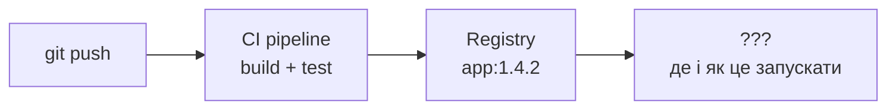

- Compose вміє запускати стек лише на **одному хості**
- У продакшні серверів багато, і керувати ними вручну не вийде
<!-- .element: class="fragment" -->

--

### А що, якщо...

<div class="card-row">
<div class="card"><b>серверів 50</b><br>на який із них запускати контейнер?</div>
<div class="card"><b>контейнер впав о 3:00</b><br>хто його підніме?</div>
<div class="card"><b>трафік зріс у 10 разів</b><br>хто додасть копій?</div>
<div class="card"><b>нова версія</b><br>як оновитися без простою?</div>
</div>

Відповідь на всі чотири питання — **оркестратор контейнерів**
<!-- .element: class="fragment" -->

Note: Тут добре зайти через питання до аудиторії: «Хто з вас перезапускав контейнер руками, бо він упав?». Далі — «А тепер уявіть, що таких контейнерів тисяча і вони розкидані по десяткам машин». Це підводить до думки, що ручне керування просто не масштабується, і потрібна система, яка робить це за нас.

---

## План заняття

1. Оркестрація та архітектура кластера
2. Робочі навантаження: Pod і Deployment
3. Мережа та конфігурація: Service, ConfigMap, Secret
4. Minikube: локальний кластер і перший деплой

---

<!-- .slide: data-background-color="#eef2ff" -->

# Частина 1

## Оркестрація та архітектура кластера

---

## Що бере на себе оркестратор

<div class="card-row">
<div class="card"><b>Scheduling</b><br>вирішує, на якому вузлі запустити контейнер</div>
<div class="card"><b>Self-healing</b><br>перезапускає впалі контейнери, переносить з мертвих вузлів</div>
<div class="card"><b>Scaling</b><br>додає або прибирає копії застосунку</div>
</div>
<div class="card-row">
<div class="card"><b>Rolling updates</b><br>оновлює версію поступово, з можливістю відкату</div>
<div class="card"><b>Service discovery</b><br>стабільні імена та балансування між копіями</div>
<div class="card"><b>Config &amp; secrets</b><br>конфігурація окремо від образу</div>
</div>

---

## Kubernetes коротко

- Відкрита платформа для оркестрації контейнерів
- Скорочення **K8s**: між «K» і «s» — 8 літер
- Сьогодні — фактичний стандарт: EKS, GKE, AKS, OpenShift, k3s — усе це Kubernetes
- Проєкт живе під егідою **CNCF** (Cloud Native Computing Foundation)
<!-- .element: class="fragment" -->

Note: Назва походить від грецького κυβερνήτης — керманич, стерновий. Звідси й логотип-штурвал, і загальна «морська» тема екосистеми: Helm (штурвал), Harbor (гавань), контейнери на кораблі. Kubernetes виріс з досвіду Google: всередині компанії більше десяти років працювала система Borg, яка керувала мільйонами контейнерів. У 2014 році Google відкрив Kubernetes як переосмислення ідей Borg, а в 2015 передав його новоствореній CNCF — це був перший проєкт фонду. Сім спиць на штурвалі логотипа — відсилка до внутрішньої кодової назви проєкту Seven of Nine, персонажа Star Trek, яка теж була «колишнім Borg».

---

## Головна ідея: декларативний підхід

<div class="card-row">
<div class="card warn"><b>Імперативно</b><br>«запусти 3 контейнери»<br>«зупини один»<br>«запусти ще один»</div>
<div class="card ok"><b>Декларативно</b><br>«хочу, щоб завжди працювало 3 копії»<br>а як цього досягти — не моя справа</div>
</div>

Ми описуємо **бажаний стан** (desired state) у YAML — Kubernetes постійно приводить до нього **поточний стан**
<!-- .element: class="fragment" -->

--

### Reconciliation loop

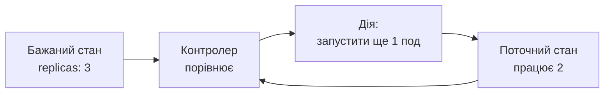

Цикл триває **нескінченно** — саме тому кластер «лікує себе сам»

Note: Хороша аналогія — кондиціонер із термостатом. Ви не кажете «охолоджуй 10 хвилин», ви кажете «хочу 22 градуси». Термостат постійно міряє температуру й вмикає або вимикає компресор. Контролери Kubernetes працюють рівно так само, тільки замість температури — кількість подів, версія образу, наявність сервісу тощо.

---

## Архітектура кластера

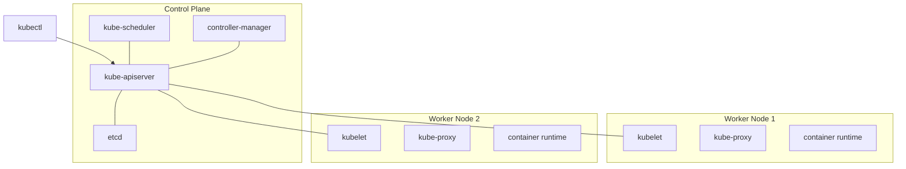

--

### Control Plane — «мозок» кластера

| Компонент | Роль |
|---|---|
| **kube-apiserver** | єдина точка входу; усі (і люди, і компоненти) спілкуються лише через нього |
| **etcd** | розподілене key-value сховище — вся «пам'ять» кластера |
| **kube-scheduler** | обирає вузол для нового пода з урахуванням ресурсів і правил |
| **kube-controller-manager** | запускає контролери, що крутять reconciliation loop |

Note: Важливий момент: компоненти не спілкуються між собою напряму, а лише через API-сервер. Scheduler не «відправляє» под на вузол — він просто записує в API, що под призначено на вузол X. А kubelet на вузлі X бачить це й запускає контейнер. Така архітектура робить систему слабко зв'язаною: будь-який компонент можна перезапустити, і він просто продовжить з того стану, що лежить в etcd. Саме тому бекап etcd — це фактично бекап усього кластера.

--

### Worker Node — «м'язи» кластера

| Компонент | Роль |
|---|---|
| **kubelet** | агент на вузлі: отримує специфікації подів і стежить, щоб контейнери працювали |
| **kube-proxy** | налаштовує мережеві правила, щоб працювали Service |
| **container runtime** | безпосередньо запускає контейнери (containerd, CRI-O) |

---

## А де тут Docker?

- Kubernetes спілкується з runtime через інтерфейс **CRI**
- Прямої підтримки Docker Engine (dockershim) у Kubernetes більше немає — зазвичай використовують **containerd**
- Але образи, зібрані через `docker build`, **працюють як і раніше** — це стандартні OCI-образи
<!-- .element: class="fragment" -->

<div class="callout">Docker — інструмент розробника для збирання образів.<br>Kubernetes — платформа для їх запуску в масштабі.</div>
<!-- .element: class="fragment" -->

Note: Коли в 2020 році оголосили, що Kubernetes відмовляється від dockershim, в інтернеті почалася паніка на кшталт «Kubernetes більше не підтримує Docker!». Насправді змінилося лише те, яким шаром кластер запускає контейнери всередині. Сам Docker Engine і так під капотом використовує containerd, тож Kubernetes просто прибрав зайвого посередника. Остаточно dockershim видалили у версії 1.24. Для розробника нічого не змінилося: ті самі Dockerfile, ті самі образи, той самий registry.

---

## Що відбувається після `kubectl apply`

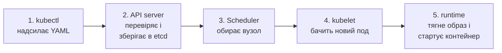

Кожен крок — окремий компонент, і всі вони зв'язані **лише через API**

---

<!-- .slide: data-background-color="#eef2ff" -->

# Частина 2

## Робочі навантаження: Pod і Deployment

---

## Pod — найменша одиниця

- Kubernetes керує не контейнерами, а **подами**
- Под — це обгортка над **одним або кількома** контейнерами
- Контейнери в поді мають **спільну мережу** (одна IP-адреса, спілкуються через `localhost`) і можуть ділити томи
- Под **ефемерний**: він може зникнути будь-якої миті, а новий отримає нову IP-адресу
<!-- .element: class="fragment" -->

Note: Назва pod — це «зграя» китів, а логотип Docker якраз кит. Отже под — це зграйка контейнерів. У 95% випадків у поді живе один контейнер, і це нормально. Кілька контейнерів в одному поді — лише коли вони дуже тісно пов'язані й мають жити та вмирати разом.

--

### Маніфест пода

```yaml
apiVersion: v1
kind: Pod
metadata:
  name: web
  labels:
    app: web
spec:
  containers:
    - name: nginx
      image: nginx:1.27
      ports:
        - containerPort: 80
```

--

### Анатомія будь-якого маніфесту

<div class="card-row">
<div class="card"><b>apiVersion</b><br>версія API, до якої належить об'єкт</div>
<div class="card"><b>kind</b><br>тип об'єкта: Pod, Deployment, Service...</div>
<div class="card"><b>metadata</b><br>ім'я, namespace, мітки</div>
<div class="card"><b>spec</b><br>бажаний стан — що ми хочемо</div>
</div>

Кластер додає ще поле **status** — поточний стан, який ми лише читаємо
<!-- .element: class="fragment" -->

---

## Кілька контейнерів в одному поді

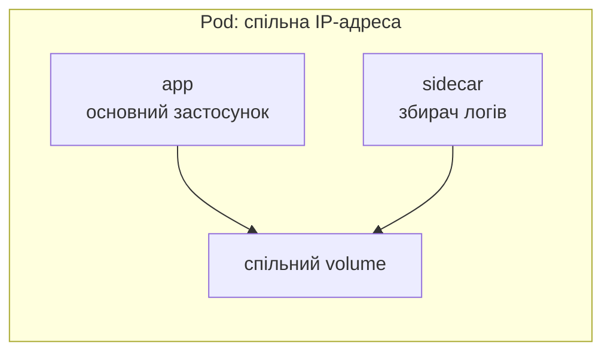

- **Sidecar** — допоміжний контейнер поруч з основним: логи, проксі, синхронізація файлів
- **Init container** — виконується **до** старту основних контейнерів: міграції, очікування залежностей

---

## Життєвий цикл пода

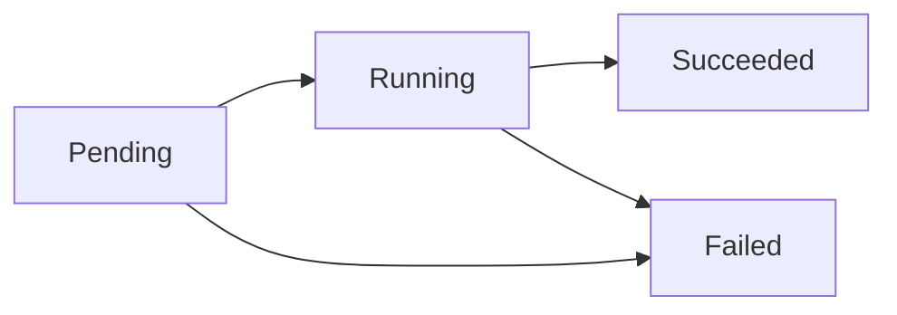

| Фаза | Що означає |
|---|---|
| **Pending** | под прийнято, але контейнери ще не запущені: чекає вузол або тягне образ |
| **Running** | под на вузлі, принаймні один контейнер працює |
| **Succeeded / Failed** | усі контейнери завершилися успішно / з помилкою |

Note: Студенти часто плутають фазу пода і статус, який показує kubectl get pods. CrashLoopBackOff, ImagePullBackOff — це не фази, а причини стану конкретного контейнера. Под у CrashLoopBackOff формально може бути в фазі Running: kubelet знову і знову перезапускає контейнер, щоразу збільшуючи паузу між спробами — звідси «BackOff».

---

## Чому поди не створюють напряму

- Под, створений вручну, **ніхто не відновить**, якщо він впаде разом із вузлом
- Потрібен хтось, хто стежить за кількістю копій → **контролер**
- На практиці ми майже завжди описуємо **Deployment**
<!-- .element: class="fragment" -->

---

## Labels і selectors — «клей» Kubernetes

- **Label** — довільна пара ключ-значення на об'єкті: `app: web`, `env: prod`
- **Selector** — запит «знайди всі об'єкти з такими мітками»
- Так Deployment знає, які поди — «його», а Service — куди слати трафік

```bash
kubectl get pods -l app=web
kubectl get pods -l 'env in (prod, staging)'
```

Note: Тут важливо підкреслити, що в Kubernetes немає жорстких посилань між об'єктами на кшталт «Service містить список подів». Зв'язок завжди динамічний — через мітки. Якщо вручну змінити мітку на поді, Deployment вважатиме, що под зник, і створить новий, а старий продовжить жити «сиротою». Це хороший трюк для дебагу: можна «витягнути» проблемний под із ротації, не вбиваючи його.

---

## Deployment → ReplicaSet → Pod

<div class="layer-stack">
<div class="layer l1">Deployment — стратегія оновлення, історія версій</div>
<div class="layer l2">ReplicaSet — тримає потрібну кількість копій</div>
<div class="layer l3">Pod · Pod · Pod — власне працюючі контейнери</div>
</div>

Ми працюємо з **Deployment**, а ReplicaSet він створює та прибирає сам
<!-- .element: class="fragment" -->

--

### Маніфест Deployment

```yaml
apiVersion: apps/v1
kind: Deployment
metadata:
  name: web
spec:
  replicas: 3
  selector:
    matchLabels:
      app: web
  template:            # шаблон пода
    metadata:
      labels:
        app: web
    spec:
      containers:
        - name: nginx
          image: nginx:1.27
          ports:
            - containerPort: 80
```

`selector.matchLabels` **обов'язково** має збігатися з мітками в `template`

---

## Rolling update

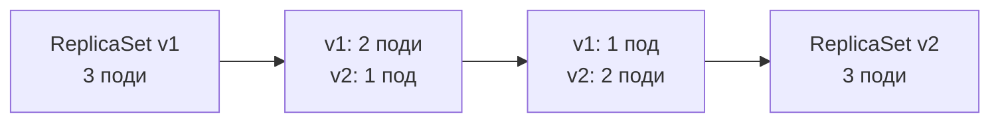

- `maxSurge` — скільки подів **понад** норму можна створити під час оновлення
- `maxUnavailable` — скільки подів можуть бути **недоступні** одночасно

--

### Керування версіями

```bash
kubectl set image deployment/web nginx=nginx:1.28
kubectl rollout status deployment/web
kubectl rollout history deployment/web
kubectl rollout undo deployment/web
```

Старий ReplicaSet не видаляється одразу — він масштабується до нуля, і саме тому **відкат миттєвий**

---

## Масштабування

```bash
kubectl scale deployment/web --replicas=5
```

- Вручну — змінюємо `replicas`
- Автоматично — **HorizontalPodAutoscaler** (HPA) за навантаженням CPU/пам'яті
- HPA потребує метрик — у кластері має працювати **metrics-server**
<!-- .element: class="fragment" -->

---

## Ресурси: requests і limits

```yaml
resources:
  requests:
    cpu: "250m"      # 0.25 ядра
    memory: "128Mi"
  limits:
    cpu: "500m"
    memory: "256Mi"
```

<div class="card-row">
<div class="card"><b>requests</b><br>гарантований мінімум — на нього орієнтується scheduler</div>
<div class="card"><b>limits</b><br>стеля: CPU обмежується, а при перевищенні пам'яті контейнер вбивається (OOMKilled)</div>
</div>

Під капотом — ті самі **cgroups**, про які говорили в темі Docker
<!-- .element: class="fragment" -->

---

## Health checks: probes

<div class="card-row">
<div class="card"><b>livenessProbe</b><br>«ти живий?»<br>ні → kubelet перезапускає контейнер</div>
<div class="card"><b>readinessProbe</b><br>«готовий приймати трафік?»<br>ні → под прибирають із Service</div>
<div class="card"><b>startupProbe</b><br>«ти вже стартував?»<br>дає повільним застосункам час на запуск</div>
</div>

```yaml
readinessProbe:
  httpGet:
    path: /health
    port: 8080
  periodSeconds: 5
```

Note: Класична помилка — зробити liveness-пробу, яка перевіряє базу даних. База лягла на хвилину — і Kubernetes починає масово перезапускати всі поди застосунку, хоча вони самі цілком здорові. У результаті маленький збій перетворюється на повну аварію. Правило: liveness перевіряє лише сам процес, а залежності — readiness.

---

## Інші контролери

| Об'єкт | Коли використовувати |
|---|---|
| **Deployment** | stateless-застосунки: веб, API |
| **StatefulSet** | стабільні імена й окреме сховище для кожної копії: бази даних, Kafka |
| **DaemonSet** | рівно по одному поду на кожному вузлі: збирачі логів, моніторинг |
| **Job** | задача, яка має завершитися: міграція, обробка даних |
| **CronJob** | Job за розкладом: нічні бекапи, звіти |

---

<!-- .slide: data-background-color="#eef2ff" -->

# Частина 3

## Мережа та конфігурація

---

## Проблема: поди приходять і йдуть

- У кожного пода своя IP-адреса, але вона **змінюється** після перезапуску
- Копій може бути 3, а за хвилину — 7
- Як фронтенду знайти бекенд?
<!-- .element: class="fragment" -->

--

### Service — стабільна точка входу

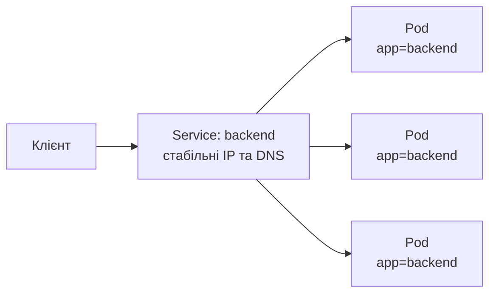

Service знаходить поди **через selector** і балансує трафік між ними

---

## Маніфест Service

```yaml
apiVersion: v1
kind: Service
metadata:
  name: backend
spec:
  type: ClusterIP
  selector:
    app: backend
  ports:
    - port: 80          # порт сервісу
      targetPort: 8080  # порт контейнера
```

Усередині кластера сервіс доступний за DNS-іменем:
`backend` → `backend.default.svc.cluster.local`

---

## Типи Service

| Тип | Доступ | Типове застосування |
|---|---|---|
| **ClusterIP** | лише всередині кластера | зв'язок між мікросервісами (типово) |
| **NodePort** | `IP_вузла:30000–32767` | швидкий доступ ззовні, навчання, тести |
| **LoadBalancer** | зовнішній балансувальник хмари | публічні сервіси в EKS/GKE/AKS |
| **ExternalName** | DNS-псевдонім на зовнішнє ім'я | звернення до зовнішньої бази як до сервісу |

Note: Типи вкладаються один в одного як матрьошка: LoadBalancer автоматично створює NodePort, а NodePort — ClusterIP. Тобто LoadBalancer-сервіс доступний усіма трьома способами одночасно. У Minikube немає справжнього хмарного балансувальника, тому для LoadBalancer там є окрема команда minikube tunnel.

---

## Ingress — HTTP-маршрутизація

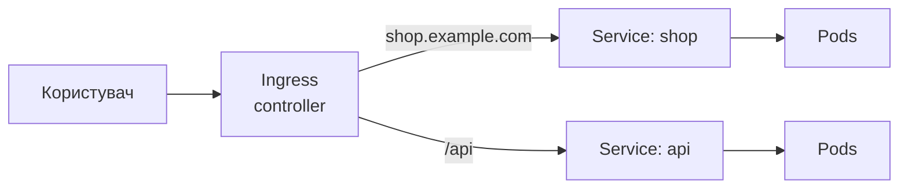

- Одна точка входу для багатьох сервісів: маршрутизація за **хостом** і **шляхом**, TLS
- Сам об'єкт Ingress — лише правила; їх виконує **Ingress controller**, який треба встановити окремо
- Сучасний наступник — **Gateway API**
<!-- .element: class="fragment" -->

Note: Про Ingress варто сказати чесно: API Ingress «заморожений» і нових можливостей не отримує, а спільнота рухається до Gateway API, який гнучкіший і краще розділяє ролі між командою платформи та командами застосунків. Крім того, популярний контролер ingress-nginx, на якому тримались тисячі кластерів, спільнота Kubernetes оголосила таким, що припиняє розвиток. Для навчання Ingress досі корисний — на ньому найпростіше зрозуміти ідею, і в Minikube його вмикають однією командою. Але в нових продакшн-проєктах варто дивитися в бік Gateway API.

---

## Namespaces

- Логічний поділ кластера: команди, середовища, проєкти
- Імена об'єктів унікальні **в межах** namespace
- Системні: `default`, `kube-system`, `kube-public`

```bash
kubectl create namespace dev
kubectl get pods -n dev
kubectl get pods -A        # усі namespaces
```

Namespace — це **не** ізоляція безпеки сам по собі: для цього потрібні RBAC, NetworkPolicy, квоти
<!-- .element: class="fragment" -->

---

## Конфігурація окремо від образу

- Один образ → різні середовища: dev, staging, prod
- Змінюється лише **конфігурація**, а не сам образ
- Kubernetes дає для цього два об'єкти: **ConfigMap** і **Secret**
<!-- .element: class="fragment" -->

Note: Це прямо з методології Twelve-Factor App від Heroku (фактор III — Config): конфігурація, яка відрізняється між середовищами, має жити в оточенні, а не в коді. Гарний тест: чи можна викласти репозиторій у відкритий доступ прямо зараз, не розкривши жодного пароля? Якщо ні — конфігурація змішана з кодом.

---

## ConfigMap

```yaml
apiVersion: v1
kind: ConfigMap
metadata:
  name: app-config
data:
  LOG_LEVEL: "info"
  APP_MODE: "production"
  app.properties: |
    cache.size=256
    feature.newUi=true
```

--

### Як под використовує ConfigMap

<div class="card-row">
<div class="card"><b>Як змінні оточення</b>

```yaml
envFrom:
  - configMapRef:
      name: app-config
```

</div>
<div class="card"><b>Як файли в томі</b>

```yaml
volumes:
  - name: cfg
    configMap:
      name: app-config
```

</div>
</div>

Змінні оточення **не оновлюються** на льоту — потрібен перезапуск пода; файли в томі оновлюються з затримкою
<!-- .element: class="fragment" -->

---

## Secret

```yaml
apiVersion: v1
kind: Secret
metadata:
  name: db-credentials
type: Opaque
stringData:          # Kubernetes сам закодує в base64
  DB_USER: app
  DB_PASSWORD: s3cr3t
```

```bash
kubectl create secret generic db-credentials \
  --from-literal=DB_USER=app --from-literal=DB_PASSWORD=s3cr3t
```

--

### Base64 — це не шифрування

<div class="callout">Будь-хто з доступом на читання Secret отримає пароль однією командою:<br><code>echo czNjcjN0 | base64 -d</code></div>

- Не комітимо Secret-маніфести з реальними значеннями в Git
- Вмикаємо **шифрування etcd** і обмежуємо доступ через **RBAC**
- У продакшні — зовнішні сховища: **Vault**, **External Secrets**, **Sealed Secrets**
<!-- .element: class="fragment" -->

Note: Чому тоді взагалі base64? Лише для того, щоб у Secret можна було зберігати бінарні дані — сертифікати, ключі. Це кодування, а не захист. Відмінність Secret від ConfigMap не в самому форматі, а в тому, що Kubernetes поводиться з ним обережніше: не показує значення в kubectl describe, дозволяє окремо налаштувати права доступу й шифрування в etcd.

---

## Сховище даних

- Файлова система контейнера **зникає** разом з ним
- **PersistentVolume (PV)** — реальний шматок диска в кластері
- **PersistentVolumeClaim (PVC)** — «заявка» пода: «мені потрібно 5Gi»
- **StorageClass** — створює PV автоматично за заявкою

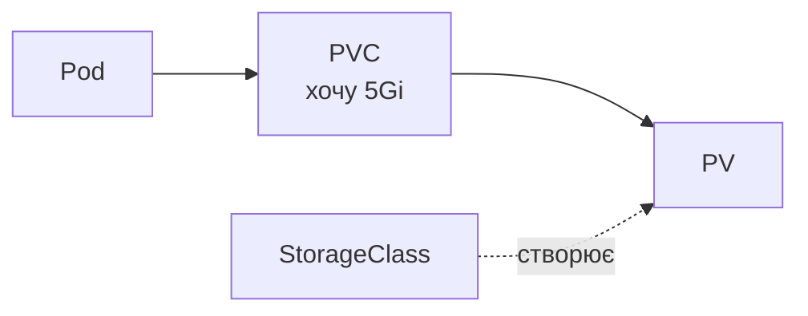

---

## Загальна картина

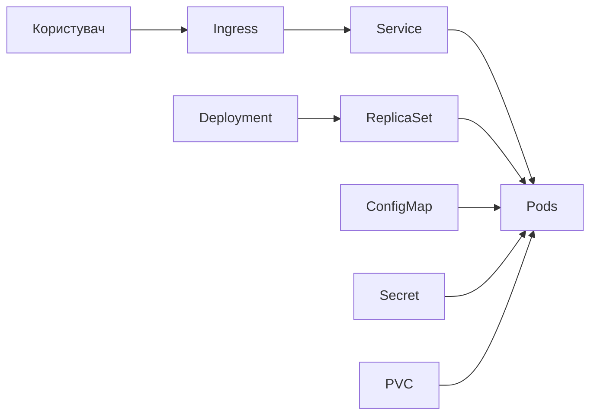

---

## Від Compose до Kubernetes

| Docker Compose | Kubernetes |
|---|---|
| `services:` | Deployment + Service |
| `image:` | `spec.containers[].image` |
| `ports:` | Service (NodePort / LoadBalancer / Ingress) |
| `environment:` | ConfigMap / Secret |
| `volumes:` | PersistentVolumeClaim |
| `restart: always` | контролер + liveness probe |
| `depends_on:` | прямого аналога немає — readiness probe, init container |

Note: Існує утиліта kompose, яка автоматично конвертує docker-compose.yml у маніфести Kubernetes. Для навчання вона корисна, щоб побачити відповідність, але в реальних проєктах результат її роботи майже завжди доводиться переписувати вручну. Окремо варто зупинитися на depends_on: у Kubernetes свідомо немає порядку запуску сервісів, бо в розподіленій системі будь-яка залежність може впасти будь-коли. Застосунок має сам уміти чекати й повторювати спроби.

---

<!-- .slide: data-background-color="#eef2ff" -->

# Частина 4

## Minikube: локальний кластер

---

## Навіщо локальний кластер

- Спробувати Kubernetes без хмари та рахунків
- Перевірити маніфести до деплою
- **Minikube** — одновузловий (за потреби — багатовузловий) кластер на вашому комп'ютері

| Інструмент | Особливість |
|---|---|
| **minikube** | найпростіший старт, багато addons, dashboard |
| **kind** | кластер у Docker-контейнерах, популярний у CI |
| **k3d / k3s** | полегшений дистрибутив, підходить і для edge |
| **Docker Desktop** | вбудований кластер одним чекбоксом |

---

## Вимоги

<div class="card-row">
<div class="card"><b>Залізо</b><br>2+ CPU<br>2 GB+ вільної RAM (краще 4)<br>20 GB диска</div>
<div class="card"><b>Драйвер</b><br>Docker (рекомендовано)<br>або VirtualBox, Hyper-V, KVM, Podman</div>
<div class="card"><b>Інше</b><br>інтернет при першому запуску<br>увімкнена віртуалізація в BIOS для VM-драйверів</div>
</div>

---

## Встановлення

--

### Linux (x86-64)

```bash
curl -LO https://github.com/kubernetes/minikube/releases/latest/download/minikube-linux-amd64
sudo install minikube-linux-amd64 /usr/local/bin/minikube
rm minikube-linux-amd64

# щоб драйвер docker працював без sudo
sudo usermod -aG docker $USER && newgrp docker
```

--

### macOS

```bash
brew install minikube
```

### Windows

```powershell
winget install Kubernetes.minikube
# або
choco install minikube
```

Актуальні команди для вашої платформи: **minikube.sigs.k8s.io/docs/start**

---

## kubectl

- Minikube має вбудований kubectl потрібної версії:

```bash
minikube kubectl -- get pods -A
alias kubectl="minikube kubectl --"
```

- Або встановлюємо kubectl окремо — minikube сам налаштує контекст у `~/.kube/config`

```bash
kubectl config current-context   # minikube
```

---

## Перший запуск

```bash
minikube start --driver=docker
minikube status
kubectl get nodes
kubectl get pods -A
```

```text
NAME       STATUS   ROLES           AGE   VERSION
minikube   Ready    control-plane   1m    v1.3x.x
```

У `kube-system` видно ті самі компоненти: **apiserver, etcd, scheduler, controller-manager, kube-proxy**
<!-- .element: class="fragment" -->

---

## Перший деплой — імперативно

```bash
kubectl create deployment hello --image=kicbase/echo-server:1.0
kubectl expose deployment hello --type=NodePort --port=8080
kubectl get pods,svc
minikube service hello        # відкриє сервіс у браузері
```

```bash
kubectl scale deployment hello --replicas=3
kubectl delete pod <ім'я-пода>    # і подивитися, як з'явиться новий
kubectl get pods -w
```

Note: Демонстрація self-healing наживо — найефектніший момент лекції. Відкрийте два термінали: в одному kubectl get pods -w, в іншому видаліть под. Студенти бачать, як за секунду з'являється новий под з іншим ім'ям. Після цього ідея reconciliation loop зазвичай «клікає» остаточно.

---

## Перший деплой — декларативно

```bash
kubectl apply -f deployment.yaml
kubectl apply -f service.yaml
# або весь каталог
kubectl apply -f k8s/
```

- Маніфести зберігаємо в **Git** разом із кодом
- `apply` ідемпотентний: повторний запуск просто приводить кластер до описаного стану
- Змінили YAML → знову `apply` → Kubernetes робить diff і оновлює лише різницю
<!-- .element: class="fragment" -->

---

## Шпаргалка kubectl

| Команда | Що робить |
|---|---|
| `kubectl get <тип>` | список об'єктів (`-o wide`, `-o yaml`) |
| `kubectl describe <тип> <ім'я>` | детальна інформація та **Events** |
| `kubectl logs <под>` | логи контейнера (`-f`, `--previous`) |
| `kubectl exec -it <под> -- sh` | зайти всередину контейнера |
| `kubectl apply -f <файл>` | створити або оновити за маніфестом |
| `kubectl delete -f <файл>` | видалити об'єкти з маніфесту |
| `kubectl port-forward svc/<ім'я> 8080:80` | прокинути порт на localhost |
| `kubectl explain deployment.spec` | вбудована документація полів |

---

## Корисне в Minikube

```bash
minikube dashboard                    # веб-інтерфейс кластера
minikube addons list
minikube addons enable ingress
minikube addons enable metrics-server
minikube image load myapp:dev         # локальний образ у кластер
minikube tunnel                       # для Service типу LoadBalancer
minikube stop                         # зупинити, зберігши стан
minikube delete                       # видалити кластер повністю
```

Note: Часта проблема студентів: зібрали образ локально через docker build, вказали його в маніфесті, а под висить у ImagePullBackOff. Причина в тому, що Minikube має власний Docker-демон або runtime, і не бачить образів хоста. Рішення — minikube image load, або виконати eval $(minikube docker-env) і збирати образ одразу всередині Minikube. І не забути imagePullPolicy: IfNotPresent або Never, інакше Kubernetes все одно спробує тягнути образ з Docker Hub, якщо тег latest.

---

## Коли щось пішло не так

| Статус | Типова причина | Куди дивитися |
|---|---|---|
| **Pending** | не вистачає ресурсів, немає вузла | `kubectl describe pod` → Events |
| **ImagePullBackOff** | помилка в імені/тегу образу, приватний registry | `describe pod`, назва образу |
| **CrashLoopBackOff** | застосунок падає під час старту | `kubectl logs --previous` |
| **Running, але не відповідає** | readiness не проходить, неправильний selector | `kubectl get endpoints`, мітки |

Правило: **спочатку `describe`, потім `logs`**
<!-- .element: class="fragment" -->

---

## Замикаємо коло: CI → кластер

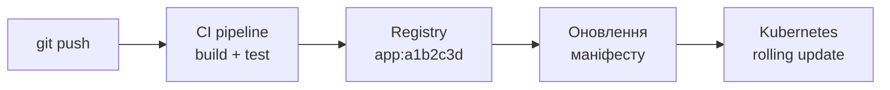

- Тегуємо образ **хешем коміту** або версією, а не `latest` — інакше незрозуміло, що саме запущено, і відкат не працює
- **Push-модель**: джоба в пайплайні сама робить `kubectl apply` або `kubectl set image`
- **Pull-модель (GitOps)**: пайплайн лише оновлює маніфест у Git, а агент у кластері підтягує зміни сам
<!-- .element: class="fragment" -->

Note: Push-модель найпростіша й добре підходить для навчання: у GitHub Actions чи GitLab CI додається ще одна джоба деплою, яка має kubeconfig у секретах. Проблема в тому, що CI-система отримує повний доступ до кластера, і будь-який зламаний пайплайн — це зламаний прод. До того ж якщо хтось змінить щось у кластері руками, пайплайн про це не дізнається. У GitOps-підході (Argo CD, Flux) облікові дані кластера взагалі не виходять за його межі: агент усередині сам стежить за Git-репозиторієм і постійно звіряє стан — це той самий reconciliation loop, тільки джерелом бажаного стану стає Git.

---

## Підсумки

- Kubernetes — **декларативна** система: описуємо бажаний стан, контролери до нього прагнуть
- **Pod** — одиниця запуску, **Deployment** — керування копіями й оновленнями
- **Service** дає стабільну адресу, **Ingress** — вхід ззовні
- **ConfigMap** і **Secret** відокремлюють конфігурацію від образу
- **Minikube** — повноцінний кластер для експериментів на ноутбуці

--

### Що далі

<div class="card-row">
<div class="card"><b>Helm</b><br>пакетний менеджер і шаблонізація маніфестів</div>
<div class="card"><b>GitOps</b><br>Argo CD, Flux: кластер синхронізується з Git</div>
<div class="card"><b>Observability</b><br>Prometheus, Grafana, логи</div>
</div>

---

# Питання?

<small>kubernetes.io/docs · minikube.sigs.k8s.io</small>
