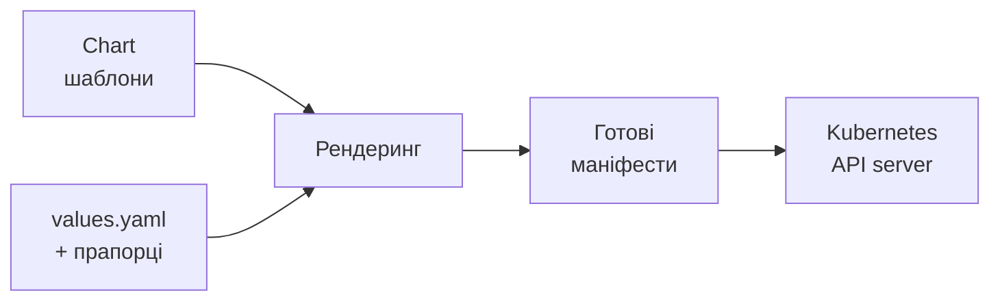
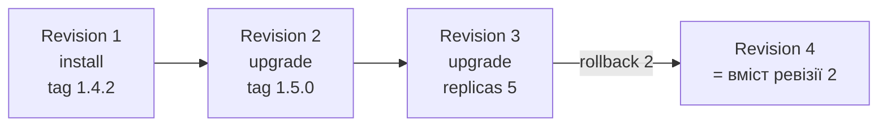
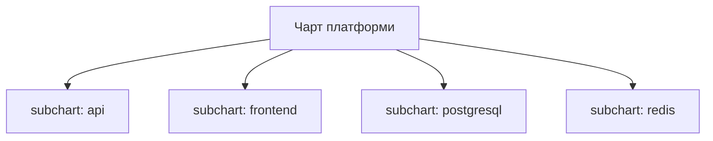
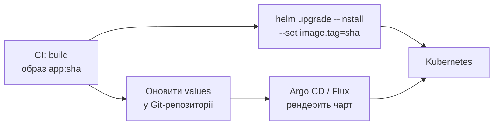

# Helm: пакетний менеджер для Kubernetes

<small>Технології DevOps</small>

<style>
.reveal h1 { font-size: 1.7em; }
.reveal h2 { font-size: 1.2em; }
.reveal h3 { font-size: 0.95em; }
.reveal p, .reveal li { font-size: 0.62em; line-height: 1.4; }
.reveal blockquote { font-size: 0.7em; }
.reveal table { font-size: 0.58em; }
.reveal small { font-size: 0.5em; }
.reveal pre, .reveal code { font-size: 0.48em; }
.reveal ol, .reveal ul { display: inline-block; text-align: left; }

.reveal .mermaid,
.reveal .mermaid svg {
  width: 100% !important;
  height: auto !important;
  max-width: 1000px;
  max-height: 560px;
}
.reveal .mermaid { display: flex; justify-content: center; }
.reveal .mermaid .nodeLabel,
.reveal .mermaid text,
.reveal .mermaid tspan,
.reveal .mermaid .edgeLabel {
  fill: #1e293b !important;
  color: #1e293b !important;
}
.reveal .mermaid .node rect,
.reveal .mermaid .node polygon,
.reveal .mermaid .node circle {
  fill: #f4f1ea !important;
  stroke: #1e293b !important;
}
.reveal .mermaid .cluster rect {
  fill: #eef2ff !important;
  stroke: #94a3b8 !important;
}

.card-row { display: flex; gap: 1.2rem; justify-content: center; margin-top: 1rem; flex-wrap: wrap; }
.card { background: #f4f1ea; border-radius: 12px; padding: 0.8rem 1.2rem; font-size: 0.6em; text-align: left; flex: 1; min-width: 220px; max-width: 320px; }
.card b { font-size: 1.1em; }
.card.warn { background: #fef3c7; }
.card.ok { background: #dcfce7; }

.tree { background: #f4f1ea; border-radius: 12px; padding: 1rem 1.5rem; font-size: 0.5em; text-align: left; display: inline-block; font-family: monospace; line-height: 1.6; }

.callout { background: #fef3c7; border-left: 6px solid #d97706; border-radius: 8px; padding: 0.6rem 1rem; font-size: 0.6em; text-align: left; margin-top: 1rem; }
</style>

Note: Ця лекція продовжує тему Kubernetes. Минулого разу ми писали маніфести руками й застосовували їх через kubectl apply. Тепер розбираємося, що робити, коли таких маніфестів десятки, середовищ кілька, а розгортати одне й те саме доводиться регулярно. Мета — щоб студенти сприймали Helm не як «ще один YAML-генератор», а як менеджер релізів: з версіями, історією й відкатом.

---

## Де ми зупинилися

- Описали застосунок набором маніфестів: Deployment, Service, Ingress, ConfigMap, Secret
- Розгортаємо через `kubectl apply -f k8s/`
- Поки застосунок один і середовище одне — усе чудово
<!-- .element: class="fragment" -->

--

### А тепер реальність

<div class="card-row">
<div class="card warn"><b>Три середовища</b><br>dev, staging, prod — відрізняються парою значень, а файли копіюються цілком</div>
<div class="card warn"><b>Десятки сервісів</b><br>у кожного майже однакові маніфести з дрібними відмінностями</div>
<div class="card warn"><b>«Що зараз на проді?»</b><br>відповідь — лише в історії git, і то якщо ніхто не правив кластер руками</div>
<div class="card warn"><b>Відкат</b><br>треба знайти старі файли й не забути жодного об'єкта</div>
</div>

Note: Корисно показати це наживо: взяти маніфести з минулої лекції, скопіювати каталог у k8s-dev і k8s-prod та змінити в них три рядки. Студенти одразу бачать, що 90% вмісту дублюється. Класична ситуація в реальних проєктах — каталог із десятком майже однакових YAML, де хтось забув синхронізувати одну зміну між середовищами, і баг ловлять лише в продакшні.

---

## План заняття

1. Навіщо потрібен Helm і його модель
2. Анатомія чарта й шаблонізація
3. Життєвий цикл релізу
4. Репозиторії, залежності та практика

---

<!-- .slide: data-background-color="#eef2ff" -->

# Частина 1

## Навіщо потрібен Helm

---

## Аналогія

- `apt`, `dnf`, `npm` — ставимо пакет однією командою, не збираючи його з вихідних кодів
- **Helm** робить те саме для Kubernetes: ставимо застосунок у кластер однією командою
- Те, що встановлюємо, називається **chart** (чарт), а встановлений екземпляр — **release** (реліз)
<!-- .element: class="fragment" -->

Note: Helm дослівно — «штурвал», ще одна назва з морської теми Kubernetes. Проєкт народився у 2015 році в компанії Deis як внутрішній інструмент, пізніше перейшов під CNCF і зараз є випускником фонду (graduated project) — тобто проєктом найвищого рівня зрілості, як і сам Kubernetes.

---

## Що дає Helm

<div class="card-row">
<div class="card"><b>Шаблони + значення</b><br>один набір маніфестів на всі середовища</div>
<div class="card"><b>Реліз як одиниця</b><br>десятки об'єктів ставляться й видаляються разом</div>
<div class="card"><b>Історія та rollback</b><br>кластер пам'ятає попередні ревізії</div>
</div>
<div class="card-row">
<div class="card"><b>Залежності</b><br>чарт може тягнути інші чарти</div>
<div class="card"><b>Репозиторії</b><br>готові чарти для типових сервісів</div>
<div class="card"><b>Параметризація</b><br>одне й те саме з іншими значеннями</div>
</div>

---

## Модель Helm



Helm — це **клієнтський інструмент**: він генерує звичайні маніфести й надсилає їх у той самий API
<!-- .element: class="fragment" -->

---

## Термінологія

| Термін | Що це |
|---|---|
| **Chart** | пакет: шаблони, значення за замовчуванням, метадані |
| **Values** | значення, якими параметризуємо чарт |
| **Release** | конкретна установка чарта в кластер, зі своїм іменем |
| **Revision** | версія релізу; кожен `upgrade` створює наступну |
| **Repository** | місце, звідки завантажуються чарти |

Один чарт можна поставити **кілька разів** в один кластер — під різними іменами релізів
<!-- .element: class="fragment" -->

---

## Helm 2 і Helm 3

- У Helm 2 у кластері жив серверний компонент **Tiller** із широкими правами — постійне джерело проблем із безпекою
- У **Helm 3** Tiller прибрали: лишився лише CLI, який працює від імені вашого користувача
- Права визначає звичайний **RBAC** — ті самі, що й у `kubectl`
<!-- .element: class="fragment" -->

Note: Tiller працював у kube-system і найчастіше його ставили з правами cluster-admin, бо так простіше. У результаті будь-хто, хто міг достукатися до Tiller, фактично отримував повний контроль над кластером. Це була одна з найчастіших знахідок під час аудитів безпеки кластерів у часи Helm 2. Якщо студенти натрапляють у статтях на helm init чи згадки Tiller — це матеріали старші за 2019 рік, і їх можна сміливо пропускати.

---

<!-- .slide: data-background-color="#eef2ff" -->

# Частина 2

## Анатомія чарта

---

## Структура каталогу

<div class="tree">
mychart/<br>
├── Chart.yaml&nbsp;&nbsp;&nbsp;&nbsp;&nbsp;&nbsp;&nbsp;# метадані чарта<br>
├── values.yaml&nbsp;&nbsp;&nbsp;&nbsp;&nbsp;# значення за замовчуванням<br>
├── charts/&nbsp;&nbsp;&nbsp;&nbsp;&nbsp;&nbsp;&nbsp;&nbsp;&nbsp;# залежності (субчарти)<br>
├── .helmignore&nbsp;&nbsp;&nbsp;&nbsp;&nbsp;# що не пакувати<br>
└── templates/<br>
&nbsp;&nbsp;&nbsp;&nbsp;├── deployment.yaml<br>
&nbsp;&nbsp;&nbsp;&nbsp;├── service.yaml<br>
&nbsp;&nbsp;&nbsp;&nbsp;├── ingress.yaml<br>
&nbsp;&nbsp;&nbsp;&nbsp;├── _helpers.tpl&nbsp;&nbsp;# спільні шматки шаблонів<br>
&nbsp;&nbsp;&nbsp;&nbsp;├── NOTES.txt&nbsp;&nbsp;&nbsp;&nbsp;&nbsp;# текст після install<br>
&nbsp;&nbsp;&nbsp;&nbsp;└── tests/
</div>

Такий каркас створює команда `helm create mychart`

---

## Chart.yaml

```yaml
apiVersion: v2
name: mychart
description: Демонстраційний чарт для курсу
type: application
version: 0.1.0        # версія самого чарта (SemVer)
appVersion: "1.4.2"   # версія застосунку всередині
dependencies:
  - name: postgresql
    version: "15.x.x"
    repository: "https://example.com/charts"
```

<div class="callout"><b>version</b> змінюємо, коли змінився чарт.<br><b>appVersion</b> — коли вийшла нова версія самого застосунку. Це різні речі.</div>
<!-- .element: class="fragment" -->

---

## values.yaml

```yaml
replicaCount: 2

image:
  repository: nginx
  tag: "1.27"
  pullPolicy: IfNotPresent

service:
  type: ClusterIP
  port: 80

resources:
  requests:
    cpu: 100m
    memory: 128Mi

ingress:
  enabled: false
```

Це **контракт** чарта: все, що користувач може налаштувати, не чіпаючи шаблони

---

## Шаблони: Go templates

```yaml
apiVersion: apps/v1
kind: Deployment
metadata:
  name: {{ .Release.Name }}-web
spec:
  replicas: {{ .Values.replicaCount }}
  template:
    spec:
      containers:
        - name: app
          image: "{{ .Values.image.repository }}:{{ .Values.image.tag }}"
          imagePullPolicy: {{ .Values.image.pullPolicy }}
```

Усе у подвійних фігурних дужках обчислюється під час рендерингу

--

### Вбудовані об'єкти

| Об'єкт | Що містить |
|---|---|
| `.Values` | значення з values.yaml і прапорців командного рядка |
| `.Release` | `.Name`, `.Namespace`, `.Revision`, `.IsUpgrade` |
| `.Chart` | поля з Chart.yaml: `.Name`, `.Version`, `.AppVersion` |
| `.Capabilities` | версія кластера й доступні API — для сумісності |
| `.Files` | доступ до файлів у чарті, зручно для ConfigMap |

---

## Функції та конвеєри

```yaml
# значення за замовчуванням, якщо не задано
tag: {{ .Values.image.tag | default .Chart.AppVersion | quote }}

# рядок у нижньому регістрі й обрізаний до 63 символів
name: {{ .Release.Name | lower | trunc 63 | trimSuffix "-" }}

# вкласти цілу структуру з правильним відступом
resources:
  {{- toYaml .Values.resources | nindent 2 }}
```

- Результат одної функції передається далі через `|` — як у шелі
- Бібліотека функцій — **Sprig**: рядки, списки, словники, дати, хеші
<!-- .element: class="fragment" -->

---

## Умови та цикли

```yaml
{{- if .Values.ingress.enabled }}
apiVersion: networking.k8s.io/v1
kind: Ingress
# ...
{{- end }}
```

```yaml
env:
  {{- range $key, $value := .Values.env }}
  - name: {{ $key }}
    value: {{ $value | quote }}
  {{- end }}
```

Дефіс у `{{-` прибирає зайвий пробільний символ **перед** виразом, а в `-}}` — після
<!-- .element: class="fragment" -->

Note: Пробіли й відступи — найбільша практична біль у Helm. YAML чутливий до відступів, а шаблонізатор нічого про YAML не знає: для нього це просто текст. Звідси два правила, які варто дати студентам одразу. Перше: майже завжди пишемо {{- з дефісом на початку рядка для керуючих конструкцій. Друге: для вкладення структур використовуємо nindent, а не ручні пробіли. І головний інструмент — helm template: він показує саме той текст, який отримає кластер, разом із усіма зламаними відступами.

---

## Іменовані шаблони: _helpers.tpl

```yaml
{{- define "mychart.labels" -}}
app.kubernetes.io/name: {{ .Chart.Name }}
app.kubernetes.io/instance: {{ .Release.Name }}
app.kubernetes.io/version: {{ .Chart.AppVersion | quote }}
app.kubernetes.io/managed-by: {{ .Release.Service }}
{{- end }}
```

```yaml
metadata:
  labels:
    {{- include "mychart.labels" . | nindent 4 }}
```

- Файли, що починаються з `_`, **не стають** маніфестами
- `include` можна передати далі в конвеєр, тому його використовують замість `template`
<!-- .element: class="fragment" -->

---

## NOTES.txt

```text
Застосунок {{ .Chart.Name }} встановлено як реліз {{ .Release.Name }}.

Отримати адресу:
  kubectl port-forward svc/{{ .Release.Name }} 8080:{{ .Values.service.port }}
```

Шаблонізується так само й виводиться після `helm install` — місце для короткої інструкції «що робити далі»

---

<!-- .slide: data-background-color="#eef2ff" -->

# Частина 3

## Життєвий цикл релізу

---

## Основні команди

```bash
helm install web ./mychart            # створити реліз
helm install web ./mychart -f prod.yaml --set replicaCount=5

helm list                             # релізи в namespace
helm status web
helm get values web                   # з якими значеннями стоїть

helm upgrade web ./mychart --set image.tag=1.5.0
helm history web
helm rollback web 2                   # повернутися до ревізії 2

helm uninstall web                    # видалити всі об'єкти релізу
```

---

## Ревізії релізу



`rollback` не видаляє історію — він створює **нову** ревізію з попереднім вмістом

---

## Де Helm зберігає стан

- Кожна ревізія лежить у кластері як **Secret** типу `helm.sh/release.v1`
- У тому ж namespace, що й сам реліз

```bash
kubectl get secret -l owner=helm
```

- Звідси два наслідки: історія доступна будь-кому з доступом до кластера, а видалення цих секретів «забирає пам'ять» у Helm
<!-- .element: class="fragment" -->

Note: Усередині такого секрету — закодований і стиснений gzip JSON з усіма відрендереними маніфестами та значеннями. Саме тому rollback працює миттєво й не потребує жодних файлів на вашому комп'ютері: Helm просто бере збережений знімок попередньої ревізії. Тут корисно нагадати студентам, що namespace має значення: якщо реліз поставили в dev, а шукають helm list у default — його просто не буде видно.

---

## Пріоритет значень

<div class="card-row">
<div class="card"><b>1. values.yaml чарта</b><br>найнижчий пріоритет</div>
<div class="card"><b>2. values батьківського чарта</b><br>для залежностей</div>
<div class="card"><b>3. файли через -f</b><br>зліва направо, наступний перекриває</div>
<div class="card ok"><b>4. --set</b><br>найвищий пріоритет</div>
</div>

```bash
helm upgrade web ./mychart -f base.yaml -f prod.yaml --set image.tag=1.5.1
```

- `--set` зручний для CI (підставити тег з коміту), а решту тримаємо у файлах
<!-- .element: class="fragment" -->

---

## Перевірка перед застосуванням

```bash
helm lint ./mychart                  # синтаксис і типові помилки
helm template web ./mychart -f prod.yaml   # показати готові маніфести
helm install web ./mychart --dry-run --debug
helm diff upgrade web ./mychart      # плагін: що саме зміниться
```

<div class="callout">Правило: спершу <code>helm template</code>, і лише потім <code>install</code>.<br>Переважна більшість помилок у чартах видно на цьому кроці.</div>
<!-- .element: class="fragment" -->

---

## Корисні прапорці

| Прапорець | Що робить |
|---|---|
| `--upgrade --install` | поставити, якщо релізу ще немає — ідемпотентно для CI |
| `--atomic` | у разі невдачі автоматично відкотити зміни |
| `--wait` | чекати, поки поди стануть готовими |
| `--timeout 5m` | скільки чекати |
| `--create-namespace` | створити namespace, якщо його немає |
| `--version 1.2.3` | зафіксувати версію чарта |

```bash
helm upgrade --install web ./mychart -f prod.yaml --atomic --wait --timeout 5m
```

Note: Саме цей рядок із upgrade --install --atomic --wait зазвичай і стоїть у job деплою в GitHub Actions чи GitLab CI. Він ідемпотентний: не важливо, перший це деплой чи сотий. І він або доводить реліз до робочого стану, або повертає все як було, а пайплайн падає з помилкою. Без --atomic можна отримати найгірший варіант: половина об'єктів оновилася, половина ні, і ніхто про це не знає.

---

## Hooks і тести

```yaml
annotations:
  "helm.sh/hook": pre-upgrade
  "helm.sh/hook-weight": "0"
  "helm.sh/hook-delete-policy": hook-succeeded
```

- Хуки виконуються на певних етапах: `pre-install`, `post-install`, `pre-upgrade`, `post-delete`
- Типове застосування — **міграції бази даних** перед оновленням застосунку
- `helm test web` запускає поди з анотацією `helm.sh/hook: test` — димові перевірки після деплою
<!-- .element: class="fragment" -->

---

<!-- .slide: data-background-color="#eef2ff" -->

# Частина 4

## Репозиторії, залежності, практика

---

## Готові чарти

```bash
helm repo add prometheus-community https://prometheus-community.github.io/helm-charts
helm repo update
helm search repo prometheus
helm show values prometheus-community/prometheus > my-values.yaml
helm install monitoring prometheus-community/prometheus -f my-values.yaml
```

- Каталог публічних чартів — **Artifact Hub**
- Сучасний спосіб поширення — **OCI-реєстри**, ті самі, де лежать Docker-образи:

```bash
helm push mychart-0.1.0.tgz oci://registry.example.com/charts
helm install web oci://registry.example.com/charts/mychart --version 0.1.0
```

Note: Тут варто сказати студентам про практичний момент. Довгі роки стандартним прикладом у будь-якому туторіалі був репозиторій Bitnami: helm install my-db bitnami/postgresql. Наприкінці 2025 року Broadcom змінив умови: публічний каталог образів Bitnami у Docker Hub закрили, старі теги перенесли в bitnamilegacy без оновлень і патчів, а підтримуваний варіант став платним. Самі чарти лишилися відкритими, але багато з них посилаються на образи, яких уже немає. Тому туторіали з bitnami/... можуть просто не працювати. Урок ширший за Helm: безкоштовний публічний реєстр — це чужа інфраструктура, і в продакшні критичні образи та чарти варто дзеркалити у власному реєстрі.

---

## Залежності

```yaml
# Chart.yaml
dependencies:
  - name: postgresql
    version: "15.5.x"
    repository: "https://charts.example.com"
    condition: postgresql.enabled
```

```bash
helm dependency update ./mychart   # завантажить субчарти в charts/
```

```yaml
# values.yaml батьківського чарта
postgresql:
  enabled: true
  auth:
    database: appdb
```

Значення для субчарта задаються **в секції з його іменем**

--

### Umbrella chart



Зручно для цілої системи, але з ростом кількості субчартів релізи стають великими й повільними
<!-- .element: class="fragment" -->

---

## Практика: свій перший чарт

```bash
minikube start

helm create demo
helm lint demo
helm template demo ./demo | less        # подивитися, що вийде

helm install demo ./demo
kubectl get all -l app.kubernetes.io/instance=demo
helm list
```

--

### Оновлення та відкат

```bash
helm upgrade demo ./demo --set replicaCount=3
kubectl get pods

helm history demo
helm rollback demo 1
kubectl get pods

helm uninstall demo
kubectl get all
```

Варто звернути увагу: `uninstall` прибирає **всі** об'єкти релізу однією командою

Note: Хороша вправа на пару: попросити студентів відкрити згенерований helm create шаблон deployment.yaml і знайти в ньому все, про що ми говорили в лекції про Kubernetes — replicas, selector, probes, resources. Виходить, що helm create — це фактично готовий приклад маніфестів з правильними мітками, і його зручно читати як довідник. Друга вправа: зламати відступ у шаблоні й подивитися, яку саме помилку покаже helm template.

---

## Helm у CI/CD і GitOps



- **Push**: джоба пайплайна сама викликає `helm upgrade --install`
- **Pull (GitOps)**: у Git лежить чарт і значення, а агент у кластері сам приводить стан до описаного
<!-- .element: class="fragment" -->

---

## Альтернативи

| Інструмент | Підхід |
|---|---|
| **Helm** | шаблони + значення, пакет і менеджер релізів |
| **Kustomize** | без шаблонів: базові маніфести + накладки (overlays), вбудований у `kubectl` |
| **Helm + Kustomize** | `helm template` і постобробка накладками — поширена комбінація |
| **Оператори** | власний контролер керує застосунком у кластері постійно, а не лише в момент деплою |

Note: Суперечка Helm проти Kustomize — одна з вічних у спільноті. Аргумент проти Helm: шаблонізація тексту поверх YAML — це крихко, великі чарти перетворюються на нечитабельні конструкції з фігурних дужок. Аргумент проти Kustomize: накладками незручно виражати умовну логіку, і немає ані пакування, ані історії релізів. На практиці найчастіше виграє простий критерій: чуже готове рішення зазвичай ставлять через Helm, бо саме так його публікують, а для власних застосунків команда обирає те, що їй зручніше.

---

## Типові помилки

<div class="card-row">
<div class="card warn"><b>Секрети у values.yaml</b><br>паролі в Git; потрібні SOPS/helm-secrets, External Secrets або Vault</div>
<div class="card warn"><b>Версія чарта не зафіксована</b><br>деплой у різний час дає різний результат</div>
<div class="card warn"><b>Правки через kubectl edit</b><br>наступний upgrade їх затре</div>
<div class="card warn"><b>Усе в одному гігантському чарті</b><br>повільні релізи й ризиковані оновлення</div>
</div>

---

## Підсумки

- Helm — **менеджер пакетів і релізів** для Kubernetes, а не просто генератор YAML
- Чарт = шаблони + `values.yaml`; одні й ті самі шаблони обслуговують усі середовища
- Реліз має **історію ревізій**, тому відкат — одна команда
- Стан зберігається в кластері, в секретах типу `helm.sh/release.v1`
- Перед застосуванням — `helm lint` і `helm template`

--

### Що далі

<div class="card-row">
<div class="card"><b>GitOps</b><br>Argo CD, Flux: кластер синхронізується з Git</div>
<div class="card"><b>Observability</b><br>Prometheus і Grafana — і те, й інше ставиться чартами</div>
<div class="card"><b>Безпека</b><br>RBAC, політики, керування секретами</div>
</div>

---

## Питання для закріплення

1. Чим `version` відрізняється від `appVersion` у `Chart.yaml`?
2. Що станеться з ревізіями, якщо виконати `helm rollback` на ревізію 2?
3. Чому `--set` перекриває значення з файлу, а не навпаки?
4. Де фізично зберігається інформація про реліз і чим це зручно?
5. Навіщо потрібен `--atomic` у джобі деплою?

---

# Дякую за увагу

<small>helm.sh/docs · artifacthub.io</small>
